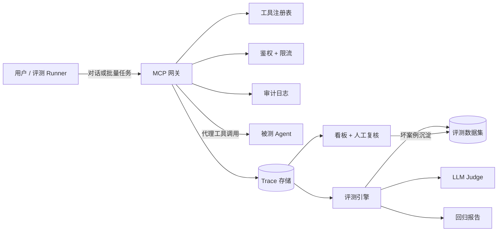

# Agent 接入与质控平台（Agent Connect & QC Platform）


> 基于 MCP 的 Agent 质量管控平台:接入 → 观测 → 评测 → 治理 闭环。

## 功能特性

- **MCP 网关**:Agent 注册、工具同步、API Key 鉴权、限流、审计日志、调用代理;
- **Trace 观测**:每次工具调用记录参数(脱敏)/结果/延迟/成本/状态,支持多条件查询;
- **评测引擎**:7 种确定性检查 + LLM-as-Judge 双轨评分,数据集/用例管理,断点续跑,回归对比;
- **看板与治理**:成功率/成本/延迟/质量趋势,Trace 浏览,人工复核队列,坏案例一键沉淀为回归用例;
- **演示闭环**:以自研"智能数据分析 Agent 团队"为首个接入对象,插桩上报真实工具调用。

## 架构



## 快速开始

### 前置条件

Python 3.11+;Node.js 18+;Docker Desktop(可选)

### 1. 后端

```powershell
cd backend
Copy-Item .env.example .env
# 编辑 .env,填入 DEEPSEEK_API_KEY(评测 Judge 需要)
python -m venv .venv
.\\.venv\\Scripts\\Activate.ps1
pip install -e ".[dev]"
python -m uvicorn app.main:app --reload
```

接口文档:`http://127.0.0.1:8000/docs`

### 2. 前端

```powershell
cd frontend
npm install
npm run dev
```

打开 `http://localhost:5173`

### 3. 种子数据与演示

```powershell
cd backend
python scripts/seed_demo.py
```

接入真实 Agent(可选):见 `docs/superpowers/plans/2026-08-15-agent-qc-platform.md` Task 27。

### 4. Docker 一键部署

```powershell
docker compose up -d --build
```

前端 `http://localhost:8080` · 后端 `http://localhost:8000`

## 评测方法论

- 确定性检查:exact / contains / regex / numeric_range / tool_called / not_tool_called / json_path;
- LLM Judge:DeepSeek 低温结构化输出,按正确性/工具使用/无幻觉/完整性打 1–5 分,失败自动降级;
- 用例通过 = 确定性检查全过 且(无 Judge 或分数 ≥ 4);
- 回归:同一数据集两个版本对比,输出通过率/均分变化与新失败清单。

## 测试

```powershell
cd backend
python -m pytest
```

## License

MIT