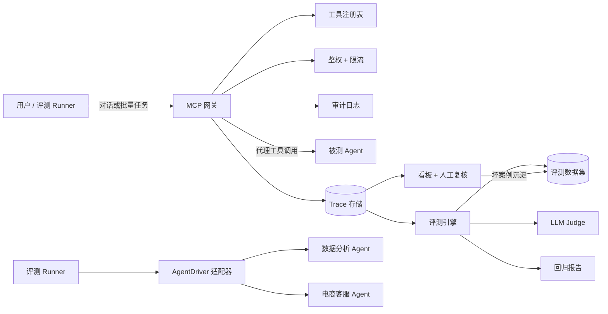

# Agent 接入与质控平台（Agent Connect & QC Platform）


> 基于 MCP 的 Agent 质量管控平台：接入 → 观测 → 评测 → 治理 闭环，支持多 Agent 接入与一键端到端演示。

## 功能特性

- **MCP 网关**：Agent 注册、工具同步、API Key 鉴权（pbkdf2）、令牌桶限流、审计日志、调用代理；
- **Trace 观测**：每次工具调用记录参数（脱敏）/结果/延迟/成本/状态，支持多条件查询；
- **评测引擎**：7 种确定性检查 + LLM-as-Judge 双轨评分（注入工具结果上下文减少误判），数据集/用例管理，断点续跑，回归对比；
- **异步评测**：接口秒回，后台线程执行，前端轮询展示逐用例进度，历史运行列表；
- **看板与治理**：成功率/成本/延迟/质量趋势，Trace 浏览，人工复核队列，坏案例一键沉淀为回归用例；
- **多 Agent 接入**：驱动适配器模式（HttpAgentDriver / CustomerServiceDriver），`connect_agent.py` 一条命令接入新 Agent；
- **一键演示**：`e2e_demo.py` 自动完成用户注册、数据上传、配置写入、建用例与评测；
- **CI**：GitHub Actions 自动跑全量测试。

## 架构



## 快速开始

### 前置条件

Python 3.11+ · Node.js 18+ · Docker Desktop（可选）

### 1. 后端

```powershell
cd backend
Copy-Item .env.example .env
# 编辑 .env,填入 DEEPSEEK_API_KEY(评测 Judge 需要)
python -m venv .venv
.\\.venv\\Scripts\\Activate.ps1
pip install -e ".[dev]"
python -m uvicorn app.main:app --reload
```

接口文档：`http://127.0.0.1:8000/docs`

### 2. 前端

```powershell
cd frontend
npm install
npm run dev
```

打开 `http://localhost:5173`（若 5173 被占用，`npm run dev -- --port 5174`）

### 3. 一键端到端演示（真实 Agent）

1. 启动被测 Agent 后端（以"智能数据分析 Agent 团队"为例，端口 8001，插桩变量配置见其 `.env`）；
2. 平台后端 8000 运行中执行：

```powershell
cd backend
python scripts/e2e_demo.py
```

首次运行会自动写入插桩与 SUT 配置并提示重启；之后直接出评测结果。

### 4. 接入新 Agent（多 Agent）

```powershell
python scripts/connect_agent.py --name "电商客服Agent" --chat-url http://127.0.0.1:8002 --driver-type customer_service --dataset "客服评测集" --cases scripts/cases_cs.json
```

支持的 `driver_type`：

- `http`：响应形状为 `{content: ...}` 的聊天 API（如数据分析 Agent，工具调用经插桩上报）；
- `customer_service`：响应自带 `tool_calls` 的聊天 API（如电商客服 Agent，无需插桩）。

形状不同时，在 `app/eval/driver.py` 新增一个 `AgentDriver` 适配器即可。

### 5. Docker 一键部署

```powershell
docker compose up -d --build
```

前端 `http://localhost:8080` · 后端 `http://localhost:8000`

## 评测方法论

- **确定性检查**：exact / contains / regex / numeric_range / tool_called / not_tool_called / json_path；
- **LLM-as-Judge**：DeepSeek 低温结构化输出，按正确性/工具使用/无幻觉/完整性打 1–5 分；评测时注入工具调用结果作为上下文，可核验回答中的数字，显著降低"无依据扣分"误判（演示中通过率 66.7% → 100%）；
- **用例通过 = 确定性检查全过 且（无 Judge 或分数 ≥ 4）**；
- **回归对比**：同一数据集两个版本逐用例对比，输出通过率/均分变化与新失败清单；
- **坏案例沉淀**：人工复核驳回 → 自动转成带 `source_trace_id` 的新用例 → 下次回归自动覆盖。

## 目录结构

```text
backend/app/
├── api/          # REST 路由（agents/traces/datasets/runs/metrics/review）
├── gateway/      # 注册/鉴权/限流/审计/MCP 代理/脱敏
├── trace/        # trace 存取
├── eval/         # 检查/Judge/数据集/驱动适配/运行编排/回归
├── core/         # 配置与数据库
├── models.py     # ORM 模型
└── schemas.py    # Pydantic 契约
backend/scripts/
├── seed_demo.py        # 演示数据（12 个真实业务场景）
├── e2e_demo.py         # 一键端到端评测（自动配置）
└── connect_agent.py    # 通用 Agent 接入
frontend/src/
├── components/   # 总览/Agents/Traces/评测/复核 五面板
└── api.ts        # 后端 API 客户端
```

## 测试与 CI

```powershell
cd backend
python -m pytest
```

推送后 GitHub Actions 自动运行全量测试。

## License

MIT
