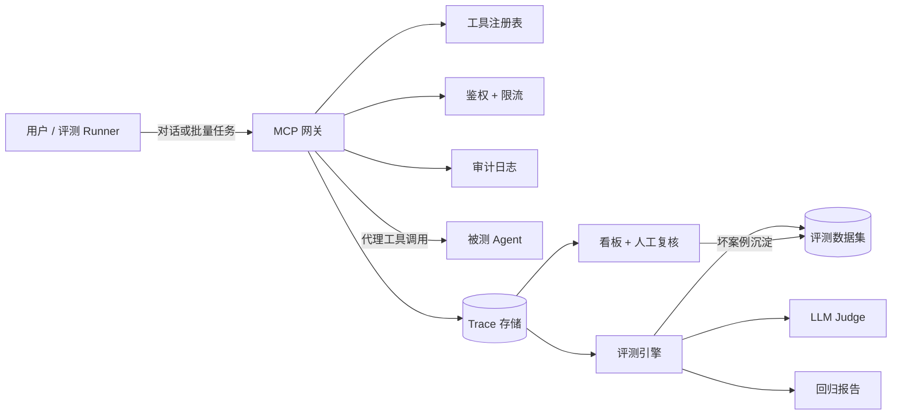

# Agent 接入与质控平台实施计划

> **For agentic workers:** REQUIRED SUB-SKILL: Use superpowers:subagent-driven-development (recommended) or superpowers:executing-plans to implement this plan task-by-task. Steps use checkbox (`- [ ]`) syntax for tracking.

**Goal:** 构建一个基于 MCP 的 Agent 质控平台，实现接入（MCP 网关）、观测（Trace）、评测（确定性校验 + LLM-as-Judge + 回归）、治理（看板 + 人工复核）闭环，并以用户已有的数据分析 Agent 作为首个真实接入对象完成演示。

**Architecture:** FastAPI 单体后端 + React 前端。后端分为四层：gateway（注册/鉴权/限流/审计/转发）、trace（采集/脱敏/查询）、eval（检查/Judge/运行编排/回归）、api（REST 路由）。评测 Runner 通过 AgentDriver 抽象驱动被测 Agent：测试用 MockDriver，真实演示用 HttpAgentDriver（调用旧项目 chat API，工具调用由旧项目插桩上报到本平台 ingest 接口）。

**Tech Stack:** Python 3.11 · FastAPI · SQLAlchemy 2 · SQLite（接口兼容 Postgres）· httpx · MCP Python SDK（客户端）· React 18 + TypeScript + Vite 5 + ECharts 5 · pytest · Docker Compose · DeepSeek（Judge 模型）

---

## 文件结构

```text
agent-qc-platform/
├── backend/
│   ├── pyproject.toml
│   ├── .env.example
│   ├── app/
│   │   ├── __init__.py
│   │   ├── main.py                 # FastAPI 应用组装
│   │   ├── core/
│   │   │   ├── __init__.py
│   │   │   ├── config.py           # 环境变量配置
│   │   │   └── db.py               # engine / SessionLocal / Base / get_db
│   │   ├── models.py               # 全部 SQLAlchemy 表
│   │   ├── schemas.py              # Pydantic 请求/响应
│   │   ├── gateway/
│   │   │   ├── __init__.py
│   │   │   ├── masking.py          # 参数脱敏
│   │   │   ├── auth.py             # pbkdf2 哈希/校验/生成
│   │   │   ├── ratelimit.py        # 令牌桶限流
│   │   │   ├── audit.py            # 审计日志
│   │   │   ├── registry.py         # Agent 注册/校验/工具同步
│   │   │   └── proxy.py            # MCP 客户端 + 转发 + 错误类型
│   │   ├── trace/
│   │   │   ├── __init__.py
│   │   │   └── store.py            # trace 创建/查询
│   │   ├── eval/
│   │   │   ├── __init__.py
│   │   │   ├── checks.py           # 7 种确定性检查
│   │   │   ├── judge.py            # LLM-as-Judge
│   │   │   ├── datasets.py         # 数据集/用例 CRUD
│   │   │   ├── driver.py           # AgentDriver 抽象 + Mock/Http 实现
│   │   │   ├── runner.py           # 评测运行编排 + 断点续跑
│   │   │   └── regression.py       # 回归对比
│   │   ├── llm.py                  # DeepSeek 客户端(重试/结构化输出)
│   │   └── api/
│   │       ├── __init__.py
│   │       ├── agents.py           # /api/v1/agents*
│   │       ├── proxy.py            # /api/v1/proxy/call
│   │       ├── traces.py           # /api/v1/traces* + /ingest
│   │       ├── datasets.py         # /api/v1/datasets*
│   │       ├── runs.py             # /api/v1/runs*
│   │       ├── metrics.py          # /api/v1/metrics*
│   │       └── review.py           # /api/v1/review-queue*
│   ├── tests/
│   │   ├── conftest.py
│   │   ├── test_masking.py
│   │   ├── test_auth.py
│   │   ├── test_ratelimit.py
│   │   ├── test_trace_store.py
│   │   ├── test_audit.py
│   │   ├── test_registry.py
│   │   ├── test_proxy.py
│   │   ├── test_checks.py
│   │   ├── test_llm.py
│   │   ├── test_judge.py
│   │   ├── test_datasets.py
│   │   ├── test_driver.py
│   │   ├── test_runner.py
│   │   ├── test_regression.py
│   │   ├── test_api_agents.py
│   │   ├── test_api_proxy.py
│   │   ├── test_api_traces.py
│   │   ├── test_api_datasets.py
│   │   ├── test_api_runs.py
│   │   ├── test_api_metrics.py
│   │   └── test_api_review.py
│   ├── sample_data/
│   │   └── sales.csv
│   └── scripts/
│       └── seed_demo.py
├── frontend/
│   ├── package.json
│   ├── vite.config.ts
│   ├── tsconfig.json
│   ├── index.html
│   ├── Dockerfile
│   ├── nginx.conf
│   └── src/
│       ├── main.tsx
│       ├── App.tsx
│       ├── api.ts
│       ├── types.ts
│       ├── styles.css
│       └── components/
│           ├── DashboardPanel.tsx
│           ├── AgentsPanel.tsx
│           ├── TracesPanel.tsx
│           ├── RunsPanel.tsx
│           └── ReviewQueue.tsx
├── backend/Dockerfile
├── docker-compose.yml
├── .gitignore
└── README.md
```

设计原则：**工具当事实来源，评测当裁判**——确定性检查优先，Judge 只做补充；每个模块独立可测；TDD 推进，频繁提交。

---

## Phase 0：项目骨架

### Task 1: 项目初始化

**Files:**
- Create: `backend/pyproject.toml`
- Create: `backend/.env.example`
- Create: `.gitignore`
- Create: `backend/app/__init__.py`
- Create: `backend/app/core/__init__.py`
- Create: `backend/app/gateway/__init__.py`
- Create: `backend/app/trace/__init__.py`
- Create: `backend/app/eval/__init__.py`
- Create: `backend/app/api/__init__.py`

- [ ] **Step 1: 创建 pyproject.toml**

```toml
[project]
name = "agent-qc-platform-backend"
version = "0.1.0"
description = "Backend for Agent Connect & QC Platform"
requires-python = ">=3.11"
dependencies = [
    "fastapi>=0.115",
    "uvicorn[standard]>=0.30",
    "sqlalchemy>=2.0",
    "pydantic-settings>=2.4",
    "python-multipart>=0.0.9",
    "httpx>=0.27",
    "mcp>=1.2",
]

[project.optional-dependencies]
dev = ["pytest>=8.0"]

[build-system]
requires = ["setuptools>=68"]
build-backend = "setuptools.build_meta"

[tool.setuptools.packages.find]
include = ["app*"]

[tool.pytest.ini_options]
testpaths = ["tests"]
pythonpath = ["."]
```

- [ ] **Step 2: 创建 .env.example**

```env
DATABASE_URL=sqlite:///./qc.db
DEEPSEEK_API_KEY=
MODEL_NAME=deepseek-v4-flash
JUDGE_MAX_RETRIES=2
JUDGE_TIMEOUT=60
SUT_CHAT_URL=
SUT_AUTH_TOKEN=
SUT_DATASET_ID=
```

- [ ] **Step 3: 创建 .gitignore**

```text
__pycache__/
*.pyc
.venv/
.pytest_cache/
.env
*.db
node_modules/
dist/
```

- [ ] **Step 4: 创建空 __init__.py（8 个）**

每个文件内容均为空文件（0 字节），创建路径见上方 Files 列表。

- [ ] **Step 5: 初始化虚拟环境并安装依赖**

```powershell
cd C:\Users\huiyi\project_agent\agent-qc-platform\backend
python -m venv .venv
.\.venv\Scripts\Activate.ps1
pip install -e ".[dev]"
```

Expected: pip 输出 Successfully installed ... agent-qc-platform-backend

- [ ] **Step 6: 验证 pytest 可运行**

```powershell
pytest -q
```

Expected: `no tests ran` 且退出码 0（目录下尚无测试文件属正常）。

- [ ] **Step 7: 提交**

```powershell
cd C:\Users\huiyi\project_agent\agent-qc-platform
git add -A
git commit -m "chore: 初始化项目骨架与依赖"
```

### Task 2: 配置、数据库与数据模型

**Files:**
- Create: `backend/app/core/config.py`
- Create: `backend/app/core/db.py`
- Create: `backend/app/models.py`
- Test: `backend/tests/conftest.py`
- Test: `backend/tests/test_models.py`

- [ ] **Step 1: 编写失败测试 conftest.py 与 test_models.py**

`backend/tests/conftest.py`：

```python
import os

os.environ["DATABASE_URL"] = "sqlite:///./test_qc.db"
os.environ["DEEPSEEK_API_KEY"] = "test-key"

import pytest
from sqlalchemy.orm import Session

from app.core.db import Base, SessionLocal, engine
from app.models import new_id


@pytest.fixture()
def db():
    Base.metadata.drop_all(bind=engine)
    Base.metadata.create_all(bind=engine)
    session = SessionLocal()
    try:
        yield session
    finally:
        session.close()
        Base.metadata.drop_all(bind=engine)


@pytest.fixture()
def sample_agent(db: Session):
    from app.models import Agent

    agent = Agent(name="demo", mcp_url="http://localhost:8000/mcp", api_key_hash="h")
    db.add(agent)
    db.commit()
    db.refresh(agent)
    return agent
```

`backend/tests/test_models.py`：

```python
from sqlalchemy import inspect
from sqlalchemy.orm import Session

from app.core.db import engine
from app.models import Agent, Trace, new_id


def test_tables_created(db: Session):
    tables = set(inspect(engine).get_table_names())
    expected = {
        "agents", "tools", "api_keys", "traces", "sessions",
        "eval_datasets", "eval_cases", "eval_runs", "eval_results",
        "audit_logs", "review_queue",
    }
    assert expected.issubset(tables)


def test_new_id_unique():
    assert len(new_id()) == 32
    assert new_id() != new_id()


def test_trace_defaults(db: Session):
    agent = Agent(name="a", mcp_url="http://x", api_key_hash="h")
    db.add(agent)
    db.commit()
    trace = Trace(agent_id=agent.id, tool_name="t", status="success")
    db.add(trace)
    db.commit()
    assert trace.params_masked_json == "{}"
    assert trace.latency_ms == 0
    assert trace.cost == 0.0
```

- [ ] **Step 2: 运行测试确认失败**

```powershell
pytest tests/test_models.py -v
```

Expected: FAIL（ModuleNotFoundError: No module named 'app.core.config'）

- [ ] **Step 3: 实现 config.py**

```python
from pydantic_settings import BaseSettings


class Settings(BaseSettings):
    app_name: str = "Agent QC Platform"
    database_url: str = "sqlite:///./qc.db"
    deepseek_api_key: str = ""
    model_name: str = "deepseek-v4-flash"
    judge_max_retries: int = 2
    judge_timeout: float = 60.0
    sut_chat_url: str = ""
    sut_auth_token: str = ""
    sut_dataset_id: str = ""
    trace_result_max_chars: int = 2000

    class Config:
        env_file = ".env"


settings = Settings()
```

- [ ] **Step 4: 实现 db.py**

```python
from sqlalchemy import create_engine
from sqlalchemy.orm import declarative_base, sessionmaker

from app.core.config import settings

connect_args = {}
if settings.database_url.startswith("sqlite"):
    connect_args = {"check_same_thread": False}

engine = create_engine(settings.database_url, connect_args=connect_args)
SessionLocal = sessionmaker(bind=engine, autoflush=False, autocommit=False)
Base = declarative_base()


def get_db():
    db = SessionLocal()
    try:
        yield db
    finally:
        db.close()
```

- [ ] **Step 5: 实现 models.py**

```python
import uuid
from datetime import datetime

from sqlalchemy import Boolean, Column, DateTime, Float, ForeignKey, Integer, String, Text

from app.core.db import Base


def new_id() -> str:
    return uuid.uuid4().hex


class Agent(Base):
    __tablename__ = "agents"
    id = Column(String(32), primary_key=True, default=new_id)
    name = Column(String(100), nullable=False)
    mcp_url = Column(String(500), nullable=False)
    api_key_hash = Column(String(128), nullable=False)
    rate_limit_qps = Column(Integer, default=5, nullable=False)
    status = Column(String(20), default="active", nullable=False)
    created_at = Column(DateTime, default=datetime.utcnow, nullable=False)


class Tool(Base):
    __tablename__ = "tools"
    id = Column(String(32), primary_key=True, default=new_id)
    agent_id = Column(String(32), ForeignKey("agents.id"), nullable=False, index=True)
    name = Column(String(100), nullable=False)
    description = Column(Text, default="")
    input_schema_json = Column(Text, default="{}")
    status = Column(String(20), default="active")
    synced_at = Column(DateTime, default=datetime.utcnow)


class ApiKey(Base):
    __tablename__ = "api_keys"
    id = Column(String(32), primary_key=True, default=new_id)
    agent_id = Column(String(32), ForeignKey("agents.id"), nullable=False, index=True)
    key_hash = Column(String(128), nullable=False)
    scopes = Column(String(100), default="all")
    created_at = Column(DateTime, default=datetime.utcnow)
    revoked_at = Column(DateTime, nullable=True)


class Trace(Base):
    __tablename__ = "traces"
    id = Column(Integer, primary_key=True, autoincrement=True)
    trace_id = Column(String(32), unique=True, nullable=False, default=new_id)
    session_id = Column(String(100), default="", index=True)
    agent_id = Column(String(32), ForeignKey("agents.id"), nullable=False, index=True)
    tool_name = Column(String(100), nullable=False)
    params_masked_json = Column(Text, default="{}")
    result_summary = Column(Text, default="")
    status = Column(String(20), nullable=False)
    latency_ms = Column(Integer, default=0)
    token_usage = Column(Integer, default=0)
    cost = Column(Float, default=0.0)
    error_code = Column(String(50), nullable=True)
    error_message = Column(Text, nullable=True)
    created_at = Column(DateTime, default=datetime.utcnow, index=True)


class ChatSession(Base):
    __tablename__ = "sessions"
    id = Column(Integer, primary_key=True, autoincrement=True)
    external_session_id = Column(String(100), unique=True, nullable=False)
    agent_id = Column(String(32), ForeignKey("agents.id"), nullable=False)
    user_ref = Column(String(100), nullable=True)
    started_at = Column(DateTime, default=datetime.utcnow)


class EvalDataset(Base):
    __tablename__ = "eval_datasets"
    id = Column(String(32), primary_key=True, default=new_id)
    name = Column(String(100), nullable=False)
    description = Column(Text, default="")
    created_at = Column(DateTime, default=datetime.utcnow)


class EvalCase(Base):
    __tablename__ = "eval_cases"
    id = Column(String(32), primary_key=True, default=new_id)
    dataset_id = Column(String(32), ForeignKey("eval_datasets.id"), nullable=False, index=True)
    input_prompt = Column(Text, nullable=False)
    expected_behavior = Column(Text, default="")
    checks_json = Column(Text, default="[]")
    source_trace_id = Column(String(32), nullable=True)
    created_at = Column(DateTime, default=datetime.utcnow)


class EvalRun(Base):
    __tablename__ = "eval_runs"
    id = Column(String(32), primary_key=True, default=new_id)
    dataset_id = Column(String(32), ForeignKey("eval_datasets.id"), nullable=False, index=True)
    agent_version = Column(String(100), nullable=False)
    status = Column(String(20), default="running")
    started_at = Column(DateTime, default=datetime.utcnow)
    finished_at = Column(DateTime, nullable=True)
    summary_json = Column(Text, nullable=True)


class EvalResult(Base):
    __tablename__ = "eval_results"
    id = Column(Integer, primary_key=True, autoincrement=True)
    run_id = Column(String(32), ForeignKey("eval_runs.id"), nullable=False, index=True)
    case_id = Column(String(32), ForeignKey("eval_cases.id"), nullable=False)
    trace_id = Column(String(32), nullable=True)
    deterministic_pass = Column(Boolean, nullable=False)
    judge_score = Column(Integer, nullable=True)
    judge_reason = Column(Text, nullable=True)
    judge_degraded = Column(Boolean, default=False)
    overall_pass = Column(Boolean, nullable=False)
    created_at = Column(DateTime, default=datetime.utcnow)


class AuditLog(Base):
    __tablename__ = "audit_logs"
    id = Column(Integer, primary_key=True, autoincrement=True)
    agent_id = Column(String(32), nullable=True, index=True)
    action = Column(String(100), nullable=False)
    request_id = Column(String(64), default="", index=True)
    source = Column(String(100), default="")
    result = Column(String(20), default="")
    created_at = Column(DateTime, default=datetime.utcnow, index=True)


class ReviewItem(Base):
    __tablename__ = "review_queue"
    id = Column(Integer, primary_key=True, autoincrement=True)
    trace_id = Column(String(32), ForeignKey("traces.trace_id"), nullable=False, unique=True)
    status = Column(String(20), default="pending")
    reviewer_note = Column(Text, nullable=True)
    created_at = Column(DateTime, default=datetime.utcnow)
    decided_at = Column(DateTime, nullable=True)
```

- [ ] **Step 6: 运行测试确认通过**

```powershell
pytest tests/test_models.py -v
```

Expected: 3 passed

- [ ] **Step 7: 提交**

```powershell
cd C:\Users\huiyi\project_agent\agent-qc-platform
git add -A
git commit -m "feat: 配置、数据库会话与全部数据模型"
```

### Task 3: FastAPI 入口与健康检查

**Files:**
- Create: `backend/app/schemas.py`
- Create: `backend/app/main.py`
- Test: `backend/tests/test_api_health.py`

- [ ] **Step 1: 编写失败测试**

`backend/tests/test_api_health.py`：

```python
from fastapi.testclient import TestClient

from app.main import app

client = TestClient(app)


def test_health():
    resp = client.get("/health")
    assert resp.status_code == 200
    assert resp.json() == {"status": "ok"}
```

- [ ] **Step 2: 运行确认失败**

```powershell
pytest tests/test_api_health.py -v
```

Expected: FAIL（ModuleNotFoundError: app.main）

- [ ] **Step 3: 创建 schemas.py**

```python
from pydantic import BaseModel


class HealthOut(BaseModel):
    status: str
```

- [ ] **Step 4: 实现 main.py**

```python
from fastapi import FastAPI
from fastapi.middleware.cors import CORSMiddleware

from app.api import agents, datasets, metrics, proxy, review, runs, traces
from app.core.config import settings
from app.core.db import Base, engine
from app.schemas import HealthOut


def create_app() -> FastAPI:
    app = FastAPI(title=settings.app_name)
    app.add_middleware(
        CORSMiddleware,
        allow_origins=["http://localhost:5173", "http://127.0.0.1:5173"],
        allow_methods=["*"],
        allow_headers=["*"],
    )
    Base.metadata.create_all(bind=engine)
    app.include_router(agents.router)
    app.include_router(proxy.router)
    app.include_router(traces.router)
    app.include_router(datasets.router)
    app.include_router(runs.router)
    app.include_router(metrics.router)
    app.include_router(review.router)

    @app.get("/health", response_model=HealthOut)
    def health() -> dict:
        return {"status": "ok"}

    return app


app = create_app()
```

main.py 引用的 7 个 router 会在后续任务填充；先创建 7 个空 router 文件让应用可启动：

`backend/app/api/agents.py`：

```python
from fastapi import APIRouter

router = APIRouter(prefix="/api/v1/agents", tags=["agents"])
```

`backend/app/api/proxy.py`：

```python
from fastapi import APIRouter

router = APIRouter(prefix="/api/v1", tags=["proxy"])
```

`backend/app/api/traces.py`：

```python
from fastapi import APIRouter

router = APIRouter(prefix="/api/v1/traces", tags=["traces"])
```

`backend/app/api/datasets.py`：

```python
from fastapi import APIRouter

router = APIRouter(prefix="/api/v1/datasets", tags=["datasets"])
```

`backend/app/api/runs.py`：

```python
from fastapi import APIRouter

router = APIRouter(prefix="/api/v1/runs", tags=["runs"])
```

`backend/app/api/metrics.py`：

```python
from fastapi import APIRouter

router = APIRouter(prefix="/api/v1/metrics", tags=["metrics"])
```

`backend/app/api/review.py`：

```python
from fastapi import APIRouter

router = APIRouter(prefix="/api/v1/review-queue", tags=["review"])
```

- [ ] **Step 5: 运行测试确认通过**

```powershell
pytest tests/test_api_health.py -v
```

Expected: 1 passed

- [ ] **Step 6: 提交**

```powershell
git add -A
git commit -m "feat: FastAPI 入口、CORS 与健康检查"
```

---

## Phase 1：MCP 网关

### Task 4: 参数脱敏 masking

**Files:**
- Create: `backend/app/gateway/masking.py`
- Test: `backend/tests/test_masking.py`

- [ ] **Step 1: 编写失败测试**

`backend/tests/test_masking.py`：

```python
from app.gateway.masking import mask_arguments, mask_text


def test_phone_masked():
    assert mask_text("电话 13812345678 联系") == "电话 138****5678 联系"


def test_long_digits_masked():
    assert mask_text("金额 1234567890 元") == "金额 12****90 元"


def test_dict_nested():
    out = mask_arguments({"sql": "select * from t where phone='13900001111'", "limit": 10})
    assert "13900001111" not in out["sql"]
    assert out["limit"] == 10
```

- [ ] **Step 2: 运行确认失败**

```powershell
pytest tests/test_masking.py -v
```

Expected: FAIL（ModuleNotFoundError）

- [ ] **Step 3: 实现 masking.py**

```python
import re

_PATTERNS = [
    (re.compile(r"1[3-9]\d{9}"), lambda m: m.group(0)[:3] + "****" + m.group(0)[-4:]),
    (re.compile(r"\d{17}[\dXx]"), lambda m: m.group(0)[:6] + "**********" + m.group(0)[-4:]),
    (re.compile(r"\d{6,}"), lambda m: m.group(0)[:2] + "****" + m.group(0)[-2:]),
]


def mask_text(value: str) -> str:
    for pattern, repl in _PATTERNS:
        value = pattern.sub(repl, value)
    return value


def mask_value(value):
    if isinstance(value, str):
        return mask_text(value)
    if isinstance(value, list):
        return [mask_value(v) for v in value]
    if isinstance(value, dict):
        return {k: mask_value(v) for k, v in value.items()}
    return value


def mask_arguments(arguments: dict) -> dict:
    return mask_value(arguments)
```

- [ ] **Step 4: 运行确认通过**

```powershell
pytest tests/test_masking.py -v
```

Expected: 3 passed

- [ ] **Step 5: 提交**

```powershell
git add -A
git commit -m "feat: 参数脱敏(手机号/长数字/嵌套结构)"
```

### Task 5: API Key 鉴权

**Files:**
- Create: `backend/app/gateway/auth.py`
- Test: `backend/tests/test_auth.py`

- [ ] **Step 1: 编写失败测试**

`backend/tests/test_auth.py`：

```python
from app.gateway.auth import generate_api_key, hash_key, verify_key


def test_generate_unique():
    assert generate_api_key().startswith("qc_")
    assert generate_api_key() != generate_api_key()


def test_hash_verify_roundtrip():
    key = generate_api_key()
    stored = hash_key(key)
    assert stored != key
    assert verify_key(key, stored)
    assert not verify_key("wrong", stored)


def test_verify_malformed():
    assert not verify_key("k", "not-a-hash")
```

- [ ] **Step 2: 运行确认失败**

```powershell
pytest tests/test_auth.py -v
```

Expected: FAIL（ModuleNotFoundError）

- [ ] **Step 3: 实现 auth.py**

```python
import hashlib
import os
import secrets

_ITERATIONS = 120_000


def hash_key(key: str) -> str:
    salt = os.urandom(16)
    dk = hashlib.pbkdf2_hmac("sha256", key.encode(), salt, _ITERATIONS)
    return f"pbkdf2${salt.hex()}${dk.hex()}"


def verify_key(key: str, stored: str) -> bool:
    try:
        _algo, salt_hex, dk_hex = stored.split("$")
        salt = bytes.fromhex(salt_hex)
        dk = hashlib.pbkdf2_hmac("sha256", key.encode(), salt, _ITERATIONS)
        return secrets.compare_digest(dk.hex(), dk_hex)
    except (ValueError, TypeError):
        return False


def generate_api_key() -> str:
    return "qc_" + secrets.token_urlsafe(24)
```

- [ ] **Step 4: 运行确认通过**

```powershell
pytest tests/test_auth.py -v
```

Expected: 3 passed

- [ ] **Step 5: 提交**

```powershell
git add -A
git commit -m "feat: API Key pbkdf2 哈希与校验"
```

### Task 6: 限流

**Files:**
- Create: `backend/app/gateway/ratelimit.py`
- Test: `backend/tests/test_ratelimit.py`

- [ ] **Step 1: 编写失败测试**

`backend/tests/test_ratelimit.py`：

```python
import time

from app.gateway.ratelimit import RateLimiter


def test_block_after_burst():
    limiter = RateLimiter()
    limiter.set_limit("a", qps=2)
    assert limiter.allow("a")
    assert limiter.allow("a")
    assert not limiter.allow("a")


def test_refill_after_wait():
    limiter = RateLimiter()
    limiter.set_limit("a", qps=4)
    limiter.allow("a")
    time.sleep(0.3)
    assert limiter.allow("a")


def test_unregistered_allowed():
    limiter = RateLimiter()
    assert limiter.allow("ghost")
```

- [ ] **Step 2: 运行确认失败**

```powershell
pytest tests/test_ratelimit.py -v
```

Expected: FAIL（ModuleNotFoundError）

- [ ] **Step 3: 实现 ratelimit.py**

```python
import threading
import time


class TokenBucket:
    def __init__(self, capacity: float, refill_per_sec: float):
        self.capacity = capacity
        self.tokens = capacity
        self.refill_per_sec = refill_per_sec
        self.updated = time.monotonic()
        self.lock = threading.Lock()

    def try_acquire(self) -> bool:
        with self.lock:
            now = time.monotonic()
            self.tokens = min(self.capacity, self.tokens + (now - self.updated) * self.refill_per_sec)
            self.updated = now
            if self.tokens >= 1.0:
                self.tokens -= 1.0
                return True
            return False


class RateLimiter:
    def __init__(self):
        self._buckets: dict[str, TokenBucket] = {}
        self._lock = threading.Lock()

    def set_limit(self, agent_id: str, qps: float) -> None:
        with self._lock:
            self._buckets[agent_id] = TokenBucket(capacity=max(1.0, qps), refill_per_sec=qps)

    def allow(self, agent_id: str) -> bool:
        with self._lock:
            bucket = self._buckets.get(agent_id)
        if bucket is None:
            return True
        return bucket.try_acquire()
```

- [ ] **Step 4: 运行确认通过**

```powershell
pytest tests/test_ratelimit.py -v
```

Expected: 3 passed

- [ ] **Step 5: 提交**

```powershell
git add -A
git commit -m "feat: 令牌桶限流"
```

### Task 7: Trace 存储

**Files:**
- Create: `backend/app/trace/store.py`
- Test: `backend/tests/test_trace_store.py`

- [ ] **Step 1: 编写失败测试**

`backend/tests/test_trace_store.py`：

```python
from sqlalchemy.orm import Session

from app.trace.store import create_trace, get_trace, list_traces, traces_by_session


def test_create_and_get(db: Session, sample_agent):
    trace = create_trace(
        db, agent_id=sample_agent.id, session_id="s1", tool_name="query_sql",
        arguments={"sql": "select 13812345678"}, result_summary="ok", status="success", latency_ms=12,
    )
    assert get_trace(db, trace.trace_id).trace_id == trace.trace_id
    assert "13812345678" not in trace.params_masked_json


def test_list_filters(db: Session, sample_agent):
    create_trace(db, agent_id=sample_agent.id, session_id="s1", tool_name="a", status="success")
    create_trace(db, agent_id=sample_agent.id, session_id="s2", tool_name="b", status="failed")
    assert len(list_traces(db, session_id="s1")) == 1
    assert len(list_traces(db, status="failed")) == 1
    assert len(list_traces(db, limit=1)) == 1


def test_by_session_order(db: Session, sample_agent):
    t1 = create_trace(db, agent_id=sample_agent.id, session_id="s1", tool_name="a", status="success")
    t2 = create_trace(db, agent_id=sample_agent.id, session_id="s1", tool_name="b", status="success")
    assert [t.tool_name for t in traces_by_session(db, "s1")] == ["a", "b"]
    assert t1.id < t2.id
```

- [ ] **Step 2: 运行确认失败**

```powershell
pytest tests/test_trace_store.py -v
```

Expected: FAIL（ModuleNotFoundError）

- [ ] **Step 3: 实现 store.py**

```python
import json

from sqlalchemy.orm import Session

from app.core.config import settings
from app.gateway.masking import mask_arguments
from app.models import Trace, new_id


def create_trace(
    db: Session,
    *,
    agent_id: str,
    session_id: str,
    tool_name: str,
    arguments: dict | None = None,
    result_summary: str = "",
    status: str = "success",
    latency_ms: int = 0,
    token_usage: int = 0,
    cost: float = 0.0,
    error_code: str | None = None,
    error_message: str | None = None,
) -> Trace:
    trace = Trace(
        trace_id=new_id(),
        session_id=session_id,
        agent_id=agent_id,
        tool_name=tool_name,
        params_masked_json=json.dumps(mask_arguments(arguments or {}), ensure_ascii=False),
        result_summary=(result_summary or "")[: settings.trace_result_max_chars],
        status=status,
        latency_ms=latency_ms,
        token_usage=token_usage,
        cost=cost,
        error_code=error_code,
        error_message=error_message,
    )
    db.add(trace)
    db.commit()
    db.refresh(trace)
    return trace


def list_traces(
    db: Session,
    *,
    agent_id: str | None = None,
    session_id: str | None = None,
    status: str | None = None,
    limit: int = 50,
    offset: int = 0,
) -> list[Trace]:
    query = db.query(Trace)
    if agent_id:
        query = query.filter(Trace.agent_id == agent_id)
    if session_id:
        query = query.filter(Trace.session_id == session_id)
    if status:
        query = query.filter(Trace.status == status)
    return query.order_by(Trace.id.desc()).offset(offset).limit(limit).all()


def get_trace(db: Session, trace_id: str) -> Trace | None:
    return db.query(Trace).filter(Trace.trace_id == trace_id).first()


def traces_by_session(db: Session, session_id: str) -> list[Trace]:
    return db.query(Trace).filter(Trace.session_id == session_id).order_by(Trace.id.asc()).all()
```

- [ ] **Step 4: 运行确认通过**

```powershell
pytest tests/test_trace_store.py -v
```

Expected: 3 passed

- [ ] **Step 5: 提交**

```powershell
git add -A
git commit -m "feat: trace 存储(脱敏/截断/多条件查询)"
```

### Task 8: 审计日志

**Files:**
- Create: `backend/app/gateway/audit.py`
- Test: `backend/tests/test_audit.py`

- [ ] **Step 1: 编写失败测试**

`backend/tests/test_audit.py`：

```python
from sqlalchemy.orm import Session

from app.gateway.audit import log_audit
from app.models import AuditLog


def test_log_audit_creates_row(db: Session, sample_agent):
    request_id = log_audit(db, sample_agent.id, "call:query_sql", source="api", result="success")
    assert request_id
    row = db.query(AuditLog).filter(AuditLog.request_id == request_id).first()
    assert row.agent_id == sample_agent.id
    assert row.action == "call:query_sql"
    assert row.result == "success"
```

- [ ] **Step 2: 运行确认失败**

```powershell
pytest tests/test_audit.py -v
```

Expected: FAIL（ModuleNotFoundError）

- [ ] **Step 3: 实现 audit.py**

```python
import uuid

from sqlalchemy.orm import Session

from app.models import AuditLog


def log_audit(
    db: Session,
    agent_id: str | None,
    action: str,
    source: str = "",
    result: str = "",
) -> str:
    request_id = uuid.uuid4().hex
    db.add(AuditLog(agent_id=agent_id, action=action, request_id=request_id, source=source, result=result))
    db.commit()
    return request_id
```

- [ ] **Step 4: 运行确认通过**

```powershell
pytest tests/test_audit.py -v
```

Expected: 1 passed

- [ ] **Step 5: 提交**

```powershell
git add -A
git commit -m "feat: 审计日志"
```

### Task 9: Agent 注册表

**Files:**
- Create: `backend/app/gateway/registry.py`
- Test: `backend/tests/test_registry.py`

- [ ] **Step 1: 编写失败测试**

`backend/tests/test_registry.py`：

```python
from sqlalchemy.orm import Session

from app.gateway.auth import hash_key
from app.gateway.registry import (
    get_active_agent,
    register_agent,
    replace_tools,
    verify_agent_key,
)
from app.models import Tool


def test_register_and_verify(db: Session):
    agent = register_agent(db, name="demo", mcp_url="http://x/mcp", api_key_hash=hash_key("secret"), rate_limit_qps=3)
    assert get_active_agent(db, agent.id).id == agent.id
    assert verify_agent_key(db, agent.id, "secret")
    assert not verify_agent_key(db, agent.id, "wrong")
    assert not verify_agent_key(db, "missing", "secret")


def test_replace_tools(db: Session, sample_agent):
    replace_tools(db, sample_agent.id, [Tool(agent_id=sample_agent.id, name="t1", description="d")])
    replace_tools(db, sample_agent.id, [Tool(agent_id=sample_agent.id, name="t2", description="d")])
    rows = db.query(Tool).filter(Tool.agent_id == sample_agent.id).all()
    assert [r.name for r in rows] == ["t2"]
```

- [ ] **Step 2: 运行确认失败**

```powershell
pytest tests/test_registry.py -v
```

Expected: FAIL（ModuleNotFoundError）

- [ ] **Step 3: 实现 registry.py**

```python
from sqlalchemy.orm import Session

from app.gateway.auth import verify_key
from app.models import Agent, Tool


def register_agent(
    db: Session,
    *,
    name: str,
    mcp_url: str,
    api_key_hash: str,
    rate_limit_qps: int = 5,
) -> Agent:
    agent = Agent(name=name, mcp_url=mcp_url, api_key_hash=api_key_hash, rate_limit_qps=rate_limit_qps)
    db.add(agent)
    db.commit()
    db.refresh(agent)
    return agent


def get_active_agent(db: Session, agent_id: str) -> Agent | None:
    agent = db.get(Agent, agent_id)
    if agent is None or agent.status != "active":
        return None
    return agent


def verify_agent_key(db: Session, agent_id: str, api_key: str) -> bool:
    agent = db.get(Agent, agent_id)
    if agent is None:
        return False
    return verify_key(api_key, agent.api_key_hash)


def replace_tools(db: Session, agent_id: str, tools: list[Tool]) -> None:
    old = db.query(Tool).filter(Tool.agent_id == agent_id).all()
    for tool in old:
        db.delete(tool)
    db.add_all(tools)
    db.commit()
```

- [ ] **Step 4: 运行确认通过**

```powershell
pytest tests/test_registry.py -v
```

Expected: 2 passed

- [ ] **Step 5: 提交**

```powershell
git add -A
git commit -m "feat: Agent 注册表与工具替换"
```

### Task 10: MCP 代理转发

**Files:**
- Create: `backend/app/gateway/proxy.py`
- Test: `backend/tests/test_proxy.py`

- [ ] **Step 1: 编写失败测试**

`backend/tests/test_proxy.py`：

```python
import pytest
from sqlalchemy.orm import Session

from app.gateway.proxy import Gateway, ProxyError, RateLimitError
from app.models import Trace


class FakeClient:
    def __init__(self, result=None, error=None):
        self.result = result or {"content": ["ok"], "is_error": False}
        self.error = error

    async def call_tool(self, name, arguments):
        if self.error:
            raise self.error
        return self.result


def test_forward_success(monkeypatch, db: Session, sample_agent):
    gateway = Gateway()
    gateway.limiter.set_limit(sample_agent.id, 100)

    async def fake_client(url):
        return FakeClient()

    monkeypatch.setattr("app.gateway.proxy.StreamableHttpMCPClient", fake_client)
    result = gateway.forward_sync(db, sample_agent, "query_sql", {"sql": "select 1"}, session_id="s1")
    assert result["status"] == "success"
    assert db.query(Trace).filter(Trace.trace_id == result["trace_id"]).first() is not None


def test_forward_ratelimited(db: Session, sample_agent):
    gateway = Gateway()
    gateway.limiter.set_limit(sample_agent.id, 0)
    with pytest.raises(RateLimitError):
        gateway.forward_sync(db, sample_agent, "query_sql", {}, session_id="s1")
    trace = db.query(Trace).order_by(Trace.id.desc()).first()
    assert trace.status == "ratelimited"


def test_forward_timeout(monkeypatch, db: Session, sample_agent):
    gateway = Gateway()
    gateway.limiter.set_limit(sample_agent.id, 100)

    class SlowClient:
        async def call_tool(self, name, arguments):
            import asyncio

            await asyncio.sleep(5)

    async def fake_client(url):
        return SlowClient()

    monkeypatch.setattr("app.gateway.proxy.StreamableHttpMCPClient", fake_client)
    with pytest.raises(ProxyError) as exc_info:
        gateway.forward_sync(db, sample_agent, "query_sql", {}, session_id="s1", timeout=0.05)
    assert exc_info.value.status_code == 504
    assert db.query(Trace).order_by(Trace.id.desc()).first().status == "timeout"
```

- [ ] **Step 2: 运行确认失败**

```powershell
pytest tests/test_proxy.py -v
```

Expected: FAIL（ModuleNotFoundError）

- [ ] **Step 3: 实现 proxy.py**

```python
import asyncio
import json
import time

from sqlalchemy.orm import Session

from app.gateway.audit import log_audit
from app.gateway.ratelimit import RateLimiter
from app.models import Agent
from app.trace.store import create_trace


class ProxyError(Exception):
    def __init__(self, status_code: int, code: str, message: str):
        self.status_code = status_code
        self.code = code
        self.message = message
        super().__init__(message)


class RateLimitError(ProxyError):
    def __init__(self, agent_id: str):
        super().__init__(429, "RATE_LIMITED", f"rate limit exceeded for agent {agent_id}")


class MCPClient:
    async def list_tools(self) -> list[dict]:
        raise NotImplementedError

    async def call_tool(self, name: str, arguments: dict) -> dict:
        raise NotImplementedError


class StreamableHttpMCPClient(MCPClient):
    def __init__(self, url: str):
        self.url = url

    async def list_tools(self) -> list[dict]:
        from mcp import ClientSession
        from mcp.client.streamable_http import streamablehttp_client

        async with streamablehttp_client(self.url) as (read, write, _):
            async with ClientSession(read, write) as session:
                await session.initialize()
                tools = await session.list_tools()
                return [
                    {"name": t.name, "description": t.description or "", "input_schema": t.inputSchema}
                    for t in tools.tools
                ]

    async def call_tool(self, name: str, arguments: dict) -> dict:
        from mcp import ClientSession
        from mcp.client.streamable_http import streamablehttp_client

        async with streamablehttp_client(self.url) as (read, write, _):
            async with ClientSession(read, write) as session:
                await session.initialize()
                result = await session.call_tool(name, arguments)
                content = []
                for block in result.content:
                    if block.type == "text":
                        content.append(block.text)
                    else:
                        content.append(json.dumps(block.model_dump(), ensure_ascii=False))
                return {"content": content, "is_error": result.isError}


class Gateway:
    def __init__(self, limiter: RateLimiter | None = None):
        self.limiter = limiter or RateLimiter()

    def forward_sync(
        self,
        db: Session,
        agent: Agent,
        tool_name: str,
        arguments: dict,
        session_id: str = "",
        source: str = "api",
        timeout: float = 30.0,
    ) -> dict:
        return asyncio.run(
            self.forward(db, agent, tool_name, arguments, session_id=session_id, source=source, timeout=timeout)
        )

    async def forward(
        self,
        db: Session,
        agent: Agent,
        tool_name: str,
        arguments: dict,
        session_id: str = "",
        source: str = "api",
        timeout: float = 30.0,
    ) -> dict:
        if not self.limiter.allow(agent.id):
            create_trace(
                db,
                agent_id=agent.id,
                session_id=session_id,
                tool_name=tool_name,
                arguments=arguments,
                status="ratelimited",
                error_code="RATE_LIMITED",
                error_message="rate limit exceeded",
            )
            log_audit(db, agent.id, f"call:{tool_name}", source=source, result="ratelimited")
            raise RateLimitError(agent.id)

        client = StreamableHttpMCPClient(agent.mcp_url)
        start = time.monotonic()
        try:
            result = await asyncio.wait_for(client.call_tool(tool_name, arguments), timeout=timeout)
            latency = int((time.monotonic() - start) * 1000)
            summary = json.dumps(result, ensure_ascii=False)
            trace = create_trace(
                db,
                agent_id=agent.id,
                session_id=session_id,
                tool_name=tool_name,
                arguments=arguments,
                result_summary=summary,
                status="success",
                latency_ms=latency,
            )
            log_audit(db, agent.id, f"call:{tool_name}", source=source, result="success")
            return {"trace_id": trace.trace_id, "result": result, "latency_ms": latency, "status": "success"}
        except asyncio.TimeoutError:
            latency = int((time.monotonic() - start) * 1000)
            trace = create_trace(
                db,
                agent_id=agent.id,
                session_id=session_id,
                tool_name=tool_name,
                arguments=arguments,
                status="timeout",
                latency_ms=latency,
                error_code="TIMEOUT",
                error_message=f"sut timeout after {timeout}s",
            )
            log_audit(db, agent.id, f"call:{tool_name}", source=source, result="timeout")
            raise ProxyError(504, "TIMEOUT", f"sut timeout after {timeout}s")
        except Exception as exc:
            latency = int((time.monotonic() - start) * 1000)
            trace = create_trace(
                db,
                agent_id=agent.id,
                session_id=session_id,
                tool_name=tool_name,
                arguments=arguments,
                status="failed",
                latency_ms=latency,
                error_code="SUT_ERROR",
                error_message=str(exc)[:500],
            )
            log_audit(db, agent.id, f"call:{tool_name}", source=source, result="failed")
            raise ProxyError(502, "SUT_ERROR", f"sut call failed: {exc}") from exc
```

说明：测试中 `forward_sync` 通过 `asyncio.run` 包裹，使同步测试可驱动异步转发逻辑；生产 API 层直接调用 `forward`。

- [ ] **Step 4: 运行确认通过**

```powershell
pytest tests/test_proxy.py -v
```

Expected: 3 passed

- [ ] **Step 5: 提交**

```powershell
git add -A
git commit -m "feat: MCP 网关转发(限流/审计/trace/错误映射)"
```

### Task 11: Agents API

**Files:**
- Update: `backend/app/schemas.py`
- Update: `backend/app/api/agents.py`
- Test: `backend/tests/test_api_agents.py`

- [ ] **Step 1: 编写失败测试**

`backend/tests/test_api_agents.py`：

```python
from fastapi.testclient import TestClient

from app.main import app

client = TestClient(app)


def test_register_and_list():
    resp = client.post("/api/v1/agents/register", json={"name": "demo", "mcp_url": "http://x/mcp", "rate_limit_qps": 5})
    assert resp.status_code == 200
    data = resp.json()
    assert data["api_key"].startswith("qc_")
    agent_id = data["id"]
    listed = client.get("/api/v1/agents").json()
    assert any(a["id"] == agent_id for a in listed)


def test_register_missing_field():
    resp = client.post("/api/v1/agents/register", json={"name": "demo"})
    assert resp.status_code == 422
```

- [ ] **Step 2: 运行确认失败**

```powershell
pytest tests/test_api_agents.py -v
```

Expected: FAIL（404 或 ImportError，路由未实现）

说明：conftest 通过环境变量 `DATABASE_URL` 指向 `test_qc.db`；`TestClient(app)` 导入 `app.main` 时 `create_app()` 已用该地址建表。若本地残留旧库，运行前删除 `backend/test_qc.db`。

- [ ] **Step 3: 更新 schemas.py（追加到 HealthOut 之后）**

```python
from datetime import datetime
from typing import Any


class AgentRegisterIn(BaseModel):
    name: str
    mcp_url: str
    rate_limit_qps: int = 5


class AgentOut(BaseModel):
    id: str
    name: str
    mcp_url: str
    rate_limit_qps: int
    status: str
    created_at: datetime

    model_config = {"from_attributes": True}


class AgentRegisterOut(AgentOut):
    api_key: str


class ToolOut(BaseModel):
    id: str
    agent_id: str
    name: str
    description: str
    status: str

    model_config = {"from_attributes": True}
```

- [ ] **Step 4: 实现 api/agents.py（替换 Step 3 的空文件）**

```python
import asyncio
import json

from fastapi import APIRouter, Depends, HTTPException
from sqlalchemy.orm import Session

from app.core.db import get_db
from app.gateway.auth import generate_api_key, hash_key
from app.gateway.proxy import StreamableHttpMCPClient
from app.gateway.ratelimit import RateLimiter
from app.gateway.registry import get_active_agent, register_agent, replace_tools
from app.models import Agent, Tool
from app.schemas import AgentOut, AgentRegisterIn, AgentRegisterOut, ToolOut

router = APIRouter(prefix="/api/v1/agents", tags=["agents"])
_limiter = RateLimiter()


@router.post("/register", response_model=AgentRegisterOut)
def register(payload: AgentRegisterIn, db: Session = Depends(get_db)):
    api_key = generate_api_key()
    agent = register_agent(
        db,
        name=payload.name,
        mcp_url=payload.mcp_url,
        api_key_hash=hash_key(api_key),
        rate_limit_qps=payload.rate_limit_qps,
    )
    _limiter.set_limit(agent.id, agent.rate_limit_qps)
    out = AgentOut.model_validate(agent).model_dump()
    return AgentRegisterOut(**out, api_key=api_key)


@router.get("", response_model=list[AgentOut])
def list_agents(db: Session = Depends(get_db)):
    return db.query(Agent).order_by(Agent.created_at.desc()).all()


@router.post("/{agent_id}/tools/sync", response_model=list[ToolOut])
def sync_tools(agent_id: str, db: Session = Depends(get_db)):
    agent = get_active_agent(db, agent_id)
    if agent is None:
        raise HTTPException(status_code=404, detail="agent not found")
    client = StreamableHttpMCPClient(agent.mcp_url)
    tools = asyncio.run(client.list_tools())
    rows = [
        Tool(
            agent_id=agent_id,
            name=t["name"],
            description=t["description"],
            input_schema_json=json.dumps(t["input_schema"], ensure_ascii=False),
        )
        for t in tools
    ]
    replace_tools(db, agent_id, rows)
    return db.query(Tool).filter(Tool.agent_id == agent_id).order_by(Tool.name.asc()).all()
```

- [ ] **Step 5: 运行确认通过**

```powershell
pytest tests/test_api_agents.py -v
```

Expected: 2 passed

- [ ] **Step 6: 提交**

```powershell
git add -A
git commit -m "feat: Agents API(注册/列表/工具同步)"
```

### Task 12: Proxy API 与 Trace Ingest API

**Files:**
- Update: `backend/app/schemas.py`
- Update: `backend/app/api/proxy.py`
- Update: `backend/app/api/traces.py`
- Test: `backend/tests/test_api_proxy.py`
- Test: `backend/tests/test_api_traces.py`

- [ ] **Step 1: 编写失败测试**

`backend/tests/test_api_proxy.py`：

```python
from fastapi.testclient import TestClient

from app.main import app

client = TestClient(app)


def _register():
    return client.post("/api/v1/agents/register", json={"name": "demo", "mcp_url": "http://x/mcp"}).json()


def test_proxy_call_requires_key():
    agent = _register()
    resp = client.post(
        "/api/v1/proxy/call",
        json={"agent_id": agent["id"], "tool_name": "query_sql", "arguments": {"sql": "select 1"}, "session_id": "s1"},
    )
    assert resp.status_code == 401


def test_proxy_call_bad_agent_key():
    agent = _register()
    resp = client.post(
        "/api/v1/proxy/call",
        json={"agent_id": agent["id"], "tool_name": "query_sql", "arguments": {}, "session_id": "s1"},
        headers={"X-Agent-Key": "wrong"},
    )
    assert resp.status_code == 401
```

`backend/tests/test_api_traces.py`：

```python
from fastapi.testclient import TestClient

from app.main import app

client = TestClient(app)


def test_ingest_and_list():
    agent = client.post("/api/v1/agents/register", json={"name": "demo", "mcp_url": "http://x/mcp"}).json()
    headers = {"X-Agent-Key": agent["api_key"]}
    resp = client.post(
        "/api/v1/traces/ingest?agent_id=" + agent["id"],
        json={
            "session_id": "s9",
            "tool_name": "query_sql",
            "arguments": {"sql": "select 13812345678"},
            "result_summary": "ok",
            "status": "success",
            "latency_ms": 5,
        },
        headers=headers,
    )
    assert resp.status_code == 201
    trace_id = resp.json()["trace_id"]
    assert "13812345678" not in resp.json()["params_masked_json"]
    detail = client.get(f"/api/v1/traces/{trace_id}")
    assert detail.status_code == 200
    listed = client.get("/api/v1/traces?session_id=s9").json()
    assert len(listed) == 1


def test_ingest_requires_valid_key():
    agent = client.post("/api/v1/agents/register", json={"name": "demo", "mcp_url": "http://x/mcp"}).json()
    resp = client.post(
        "/api/v1/traces/ingest?agent_id=" + agent["id"],
        json={"session_id": "s1", "tool_name": "t", "arguments": {}},
        headers={"X-Agent-Key": "bad"},
    )
    assert resp.status_code == 401
```

- [ ] **Step 2: 运行确认失败**

```powershell
pytest tests/test_api_proxy.py tests/test_api_traces.py -v
```

Expected: FAIL（404 或 ImportError）

- [ ] **Step 3: 更新 schemas.py（追加）**

```python
class ProxyCallIn(BaseModel):
    agent_id: str
    tool_name: str
    arguments: dict[str, Any] = {}
    session_id: str = ""


class ProxyCallOut(BaseModel):
    trace_id: str
    result: Any
    latency_ms: int
    status: str


class TraceOut(BaseModel):
    id: int
    trace_id: str
    session_id: str
    agent_id: str
    tool_name: str
    params_masked_json: str
    result_summary: str
    status: str
    latency_ms: int
    token_usage: int
    cost: float
    error_code: str | None
    error_message: str | None
    created_at: datetime

    model_config = {"from_attributes": True}


class TraceIngestIn(BaseModel):
    session_id: str = ""
    tool_name: str
    arguments: dict[str, Any] = {}
    result_summary: str = ""
    status: str = "success"
    latency_ms: int = 0
    token_usage: int = 0
    cost: float = 0.0
    error_code: str | None = None
    error_message: str | None = None
```

- [ ] **Step 4: 实现 api/proxy.py（替换 Step 3 的空文件）**

```python
from fastapi import APIRouter, Depends, Header, HTTPException
from sqlalchemy.orm import Session

from app.core.db import get_db
from app.gateway.proxy import Gateway, ProxyError, RateLimitError
from app.gateway.registry import get_active_agent, verify_agent_key
from app.schemas import ProxyCallIn, ProxyCallOut

router = APIRouter(prefix="/api/v1", tags=["proxy"])
gateway = Gateway()


@router.post("/proxy/call", response_model=ProxyCallOut)
async def proxy_call(
    payload: ProxyCallIn,
    x_agent_key: str | None = Header(None),
    db: Session = Depends(get_db),
):
    agent = get_active_agent(db, payload.agent_id)
    if agent is None:
        raise HTTPException(status_code=404, detail="agent not found")
    if not verify_agent_key(db, payload.agent_id, x_agent_key or ""):
        raise HTTPException(status_code=401, detail="invalid agent key")
    try:
        return await gateway.forward(
            db,
            agent,
            payload.tool_name,
            payload.arguments,
            session_id=payload.session_id,
            source="proxy/api",
        )
    except RateLimitError as exc:
        raise HTTPException(status_code=429, detail=exc.message, headers={"Retry-After": "1"})
    except ProxyError as exc:
        raise HTTPException(status_code=exc.status_code, detail=exc.message)
```

- [ ] **Step 5: 实现 api/traces.py（替换 Step 3 的空文件）**

```python
from fastapi import APIRouter, Depends, Header, HTTPException, Query
from sqlalchemy.orm import Session

from app.core.db import get_db
from app.gateway.registry import verify_agent_key
from app.schemas import TraceIngestIn, TraceOut
from app.trace.store import create_trace, get_trace, list_traces

router = APIRouter(prefix="/api/v1/traces", tags=["traces"])


@router.get("", response_model=list[TraceOut])
def list_traces_api(
    agent_id: str | None = None,
    session_id: str | None = None,
    status: str | None = None,
    limit: int = Query(50, le=500),
    offset: int = 0,
    db: Session = Depends(get_db),
):
    return list_traces(db, agent_id=agent_id, session_id=session_id, status=status, limit=limit, offset=offset)


@router.get("/{trace_id}", response_model=TraceOut)
def get_trace_api(trace_id: str, db: Session = Depends(get_db)):
    trace = get_trace(db, trace_id)
    if trace is None:
        raise HTTPException(status_code=404, detail="trace not found")
    return trace


@router.post("/ingest", response_model=TraceOut, status_code=201)
def ingest(
    payload: TraceIngestIn,
    agent_id: str = Query(...),
    x_agent_key: str | None = Header(None),
    db: Session = Depends(get_db),
):
    if not verify_agent_key(db, agent_id, x_agent_key or ""):
        raise HTTPException(status_code=401, detail="invalid agent key")
    return create_trace(
        db,
        agent_id=agent_id,
        session_id=payload.session_id,
        tool_name=payload.tool_name,
        arguments=payload.arguments,
        result_summary=payload.result_summary,
        status=payload.status,
        latency_ms=payload.latency_ms,
        token_usage=payload.token_usage,
        cost=payload.cost,
        error_code=payload.error_code,
        error_message=payload.error_message,
    )
```

- [ ] **Step 6: 运行确认通过**

```powershell
pytest tests/test_api_proxy.py tests/test_api_traces.py -v
```

Expected: 4 passed

- [ ] **Step 7: 提交**

```powershell
git add -A
git commit -m "feat: Proxy API 与 Trace Ingest API"
```

---

## Phase 2：评测引擎

### Task 13: 确定性检查

**Files:**
- Create: `backend/app/eval/checks.py`
- Test: `backend/tests/test_checks.py`

- [ ] **Step 1: 编写失败测试**

`backend/tests/test_checks.py`：

```python
from app.eval.checks import CaseOutput, run_check, run_checks


def output(answer="", tool_calls=None):
    return CaseOutput(answer=answer, tool_calls=tool_calls or [])


def test_exact_and_contains():
    assert run_check({"type": "exact", "value": "42"}, output("42"))[0]
    assert not run_check({"type": "exact", "value": "42"}, output("43"))[0]
    assert run_check({"type": "contains", "value": "退款"}, output("退款率按 X 计算"))[0]


def test_regex_and_numeric_range():
    assert run_check({"type": "regex", "pattern": r"\d+%"}, output("转化率 12.5%"))[0]
    passed, _ = run_check({"type": "numeric_range", "min": 10, "max": 20}, output("下降 15%"))
    assert passed


def test_tool_checks():
    out = output(tool_calls=["load_dataset", "query_sql"])
    assert run_check({"type": "tool_called", "tool": "query_sql"}, out)[0]
    assert run_check({"type": "not_tool_called", "tool": "delete_dataset"}, out)[0]
    assert not run_check({"type": "tool_called", "tool": "chart"}, out)[0]


def test_json_path_check():
    out = output('{"sales": {"q1": 100}}')
    assert run_check({"type": "json_path", "path": "sales.q1", "op": "eq", "value": 100}, out)[0]


def test_unknown_check_fails():
    assert not run_check({"type": "nope"}, output())[0]


def test_run_checks_skips_judge():
    checks = [{"type": "contains", "value": "ok"}, {"type": "judge"}]
    passed, details = run_checks(checks, output("ok"))
    assert passed
    assert len(details) == 1
```

- [ ] **Step 2: 运行确认失败**

```powershell
pytest tests/test_checks.py -v
```

Expected: FAIL（ModuleNotFoundError）

- [ ] **Step 3: 实现 checks.py**

```python
import json
import re


class CaseOutput:
    def __init__(self, answer: str, tool_calls: list[str] | None = None, trace_id: str | None = None):
        self.answer = answer
        self.tool_calls = tool_calls or []
        self.trace_id = trace_id


def _resolve_path(data, path: str):
    node = data
    for part in path.split("."):
        if isinstance(node, dict) and part in node:
            node = node[part]
        elif isinstance(node, list) and part.isdigit() and int(part) < len(node):
            node = node[int(part)]
        else:
            return None
    return node


def run_check(check: dict, output: CaseOutput) -> tuple[bool, str]:
    ctype = check.get("type")
    if ctype == "exact":
        return output.answer.strip() == str(check.get("value", "")), f"exact 期望={check.get('value')!r}"
    if ctype == "contains":
        return str(check.get("value", "")) in output.answer, f"contains 期望包含={check.get('value')!r}"
    if ctype == "regex":
        try:
            return re.search(str(check.get("pattern", "")), output.answer) is not None, f"regex={check.get('pattern')}"
        except re.error as exc:
            return False, f"regex 非法:{exc}"
    if ctype == "numeric_range":
        match = re.search(r"-?\d+(?:\.\d+)?", output.answer)
        if not match:
            return False, "numeric_range 未找到数字"
        value = float(match.group(0))
        lo = check.get("min")
        hi = check.get("max")
        ok = (lo is None or value >= lo) and (hi is None or value <= hi)
        return ok, f"numeric_range 值={value}"
    if ctype == "tool_called":
        tool = str(check.get("tool", ""))
        return tool in output.tool_calls, f"tool_called 期望={tool} 实际={output.tool_calls}"
    if ctype == "not_tool_called":
        tool = str(check.get("tool", ""))
        return tool not in output.tool_calls, f"not_tool_called 禁止={tool} 实际={output.tool_calls}"
    if ctype == "json_path":
        try:
            data = json.loads(output.answer)
        except json.JSONDecodeError:
            return False, "json_path 答案不是合法 JSON"
        value = _resolve_path(data, str(check.get("path", "")))
        expected = check.get("value")
        op = check.get("op", "eq")
        if op == "eq":
            return value == expected, f"json_path {check.get('path')}={value!r}"
        if op == "contains":
            return expected in value if isinstance(value, (list, str, dict)) else False, "json_path contains"
        return False, f"未知 op={op}"
    return False, f"未知检查类型={ctype}"


def run_checks(checks: list[dict], output: CaseOutput) -> tuple[bool, list[dict]]:
    details = []
    for check in checks:
        if check.get("type") == "judge":
            continue
        passed, message = run_check(check, output)
        details.append({"check": check, "passed": passed, "message": message})
    return all(d["passed"] for d in details), details
```

- [ ] **Step 4: 运行确认通过**

```powershell
pytest tests/test_checks.py -v
```

Expected: 7 passed

- [ ] **Step 5: 提交**

```powershell
git add -A
git commit -m "feat: 7 种确定性检查"
```

### Task 14: LLM 客户端

**Files:**
- Create: `backend/app/llm.py`
- Test: `backend/tests/test_llm.py`

- [ ] **Step 1: 编写失败测试**

`backend/tests/test_llm.py`：

```python
import pytest

from app.core.config import settings
from app.llm import LLMError, chat_json


def test_chat_json_requires_key(monkeypatch):
    monkeypatch.setattr(settings, "deepseek_api_key", "")
    with pytest.raises(LLMError):
        chat_json("sys", "user")


def test_chat_json_retries_then_raises(monkeypatch):
    monkeypatch.setattr(settings, "deepseek_api_key", "k")
    monkeypatch.setattr(settings, "judge_max_retries", 1)

    class FakeResponse:
        def raise_for_status(self):
            raise RuntimeError("boom")

    class FakeClient:
        def post(self, *args, **kwargs):
            return FakeResponse()

    monkeypatch.setattr("app.llm.httpx.Client", lambda **kwargs: FakeClient())
    with pytest.raises(LLMError):
        chat_json("sys", "user")


def test_chat_json_parses_dict(monkeypatch):
    monkeypatch.setattr(settings, "deepseek_api_key", "k")
    monkeypatch.setattr(settings, "judge_max_retries", 0)

    class FakeResponse:
        def raise_for_status(self):
            pass

        def json(self):
            return {"choices": [{"message": {"content": '{"score": 5, "reason": "good"}'}}]}

    class FakeClient:
        def post(self, *args, **kwargs):
            return FakeResponse()

    monkeypatch.setattr("app.llm.httpx.Client", lambda **kwargs: FakeClient())
    result = chat_json("sys", "user")
    assert result["score"] == 5
```

- [ ] **Step 2: 运行确认失败**

```powershell
pytest tests/test_llm.py -v
```

Expected: FAIL（ModuleNotFoundError）

- [ ] **Step 3: 实现 llm.py**

```python
import json
import time

import httpx

from app.core.config import settings


class LLMError(Exception):
    pass


def chat_json(
    system: str,
    user: str,
    *,
    timeout: float | None = None,
    max_retries: int | None = None,
) -> dict:
    if not settings.deepseek_api_key:
        raise LLMError("DEEPSEEK_API_KEY 未配置")
    url = "https://api.deepseek.com/v1/chat/completions"
    headers = {"Authorization": f"Bearer {settings.deepseek_api_key}", "Content-Type": "application/json"}
    payload = {
        "model": settings.model_name,
        "messages": [{"role": "system", "content": system}, {"role": "user", "content": user}],
        "temperature": 0,
        "response_format": {"type": "json_object"},
    }
    timeout = settings.judge_timeout if timeout is None else timeout
    max_retries = settings.judge_max_retries if max_retries is None else max_retries
    last_exc: Exception | None = None
    with httpx.Client(timeout=timeout) as client:
        for attempt in range(max_retries + 1):
            try:
                resp = client.post(url, headers=headers, json=payload)
                resp.raise_for_status()
                data = resp.json()
                content = data["choices"][0]["message"]["content"]
                parsed = json.loads(content)
                if isinstance(parsed, dict):
                    return parsed
                raise LLMError(f"非 JSON 对象输出: {content[:200]}")
            except Exception as exc:
                last_exc = exc
                if attempt < max_retries:
                    time.sleep(2 ** attempt)
    raise LLMError(f"LLM 调用失败: {last_exc}")
```

- [ ] **Step 4: 运行确认通过**

```powershell
pytest tests/test_llm.py -v
```

Expected: 3 passed

- [ ] **Step 5: 提交**

```powershell
git add -A
git commit -m "feat: DeepSeek 客户端(重试/结构化 JSON)"
```

### Task 15: LLM Judge

**Files:**
- Create: `backend/app/eval/judge.py`
- Test: `backend/tests/test_judge.py`

- [ ] **Step 1: 编写失败测试**

`backend/tests/test_judge.py`：

```python
import pytest

from app.eval.judge import JudgeError, judge_answer


def test_judge_ok(monkeypatch):
    def fake_chat_json(system, user):
        return {"score": 4, "reason": "正确", "issues": []}

    monkeypatch.setattr("app.eval.judge.chat_json", fake_chat_json)
    result = judge_answer("问题", "回答", "期望")
    assert result["score"] == 4


def test_judge_clamps_score(monkeypatch):
    monkeypatch.setattr("app.eval.judge.chat_json", lambda s, u: {"score": 99, "reason": "x", "issues": []})
    assert judge_answer("q", "a", "e")["score"] == 5


def test_judge_error_propagates(monkeypatch):
    from app.llm import LLMError

    def fail(system, user):
        raise LLMError("down")

    monkeypatch.setattr("app.eval.judge.chat_json", fail)
    with pytest.raises(JudgeError):
        judge_answer("q", "a", "e")
```

- [ ] **Step 2: 运行确认失败**

```powershell
pytest tests/test_judge.py -v
```

Expected: FAIL（ModuleNotFoundError）

- [ ] **Step 3: 实现 judge.py**

```python
from app.llm import LLMError, chat_json


class JudgeError(Exception):
    pass


_RUBRIC = (
    "请按 1-5 分评估回答质量(只输出整数):\n"
    "5=完全正确且完整;4=正确但略有遗漏;3=部分正确;2=存在明显错误;1=严重错误或幻觉。\n"
    "评分维度:正确性(事实与工具结果一致)、工具使用恰当性、无幻觉(数字必须有出处)、完整性。\n"
    "必须输出 JSON: {\"score\": int, \"reason\": str, \"issues\": [str]}\n"
    "禁止输出其它内容。"
)


def judge_answer(question: str, answer: str, expected_behavior: str = "") -> dict:
    user = f"问题: {question}\n期望行为: {expected_behavior or '(未提供)'}\n回答: {answer}"
    try:
        result = chat_json(_RUBRIC, user)
    except LLMError as exc:
        raise JudgeError(str(exc)) from exc
    score = int(result.get("score", 1))
    score = max(1, min(5, score))
    return {
        "score": score,
        "reason": str(result.get("reason", "")),
        "issues": result.get("issues", []),
    }
```

- [ ] **Step 4: 运行确认通过**

```powershell
pytest tests/test_judge.py -v
```

Expected: 3 passed

- [ ] **Step 5: 提交**

```powershell
git add -A
git commit -m "feat: LLM-as-Judge 评分与降级异常"
```

### Task 16: 数据集 CRUD

**Files:**
- Create: `backend/app/eval/datasets.py`
- Test: `backend/tests/test_datasets.py`

- [ ] **Step 1: 编写失败测试**

`backend/tests/test_datasets.py`：

```python
from sqlalchemy.orm import Session

from app.eval.datasets import add_case, create_dataset, get_dataset, list_cases, list_datasets


def test_dataset_crud(db: Session):
    ds = create_dataset(db, name="电商", description="电商口径")
    assert get_dataset(db, ds.id).name == "电商"
    case = add_case(
        db, ds.id,
        input_prompt="退款率怎么算?",
        expected_behavior="返回退款口径",
        checks=[{"type": "contains", "value": "退款"}],
    )
    assert case.source_trace_id is None
    assert len(list_cases(db, ds.id)) == 1
    assert len(list_datasets(db)) == 1
```

- [ ] **Step 2: 运行确认失败**

```powershell
pytest tests/test_datasets.py -v
```

Expected: FAIL（ModuleNotFoundError）

- [ ] **Step 3: 实现 datasets.py**

```python
import json

from sqlalchemy.orm import Session

from app.models import EvalCase, EvalDataset


def create_dataset(db: Session, name: str, description: str = "") -> EvalDataset:
    ds = EvalDataset(name=name, description=description)
    db.add(ds)
    db.commit()
    db.refresh(ds)
    return ds


def list_datasets(db: Session) -> list[EvalDataset]:
    return db.query(EvalDataset).order_by(EvalDataset.created_at.desc()).all()


def get_dataset(db: Session, dataset_id: str) -> EvalDataset | None:
    return db.get(EvalDataset, dataset_id)


def add_case(
    db: Session,
    dataset_id: str,
    *,
    input_prompt: str,
    expected_behavior: str = "",
    checks: list[dict] | None = None,
    source_trace_id: str | None = None,
) -> EvalCase:
    case = EvalCase(
        dataset_id=dataset_id,
        input_prompt=input_prompt,
        expected_behavior=expected_behavior,
        checks_json=json.dumps(checks or [], ensure_ascii=False),
        source_trace_id=source_trace_id,
    )
    db.add(case)
    db.commit()
    db.refresh(case)
    return case


def list_cases(db: Session, dataset_id: str) -> list[EvalCase]:
    return (
        db.query(EvalCase)
        .filter(EvalCase.dataset_id == dataset_id)
        .order_by(EvalCase.created_at.asc())
        .all()
    )
```

- [ ] **Step 4: 运行确认通过**

```powershell
pytest tests/test_datasets.py -v
```

Expected: 1 passed

- [ ] **Step 5: 提交**

```powershell
git add -A
git commit -m "feat: 评测数据集与用例 CRUD"
```

### Task 17: Agent 驱动

**Files:**
- Create: `backend/app/eval/driver.py`
- Test: `backend/tests/test_driver.py`

- [ ] **Step 1: 编写失败测试**

`backend/tests/test_driver.py`：

```python
from app.eval.driver import CaseOutput, HttpAgentDriver, MockDriver


def test_mock_driver():
    driver = MockDriver(answer="ok", tool_calls=["load_dataset"])
    out = driver.run("问题", "run1")
    assert out.answer == "ok"
    assert out.tool_calls == ["load_dataset"]


def test_http_driver_calls_sut_and_loads_traces(monkeypatch):
    class FakeResponse:
        def __init__(self, data):
            self._data = data

        def raise_for_status(self):
            pass

        def json(self):
            return self._data

    class FakeClient:
        def __init__(self):
            self.calls = []

        def __enter__(self):
            return self

        def __exit__(self, *args):
            pass

        def post(self, url, json=None, headers=None):
            self.calls.append(url)
            if url.endswith("/api/sessions"):
                return FakeResponse({"id": "sid-1", "title": "t"})
            return FakeResponse({"content": "答案是 42"})

    fake = FakeClient()
    monkeypatch.setattr("app.eval.driver.httpx.Client", lambda **kwargs: fake)

    class FakeTrace:
        tool_name = "query_sql"
        trace_id = "tr-1"

    driver = HttpAgentDriver(chat_url="http://sut", auth_token="tok", trace_loader=lambda sid: [FakeTrace()])
    out = driver.run("问题", "run1")
    assert out.answer == "答案是 42"
    assert out.tool_calls == ["query_sql"]
    assert out.trace_id == "tr-1"
    assert len(fake.calls) == 2
```

- [ ] **Step 2: 运行确认失败**

```powershell
pytest tests/test_driver.py -v
```

Expected: FAIL（ModuleNotFoundError）

- [ ] **Step 3: 实现 driver.py**

```python
import httpx


from app.eval.checks import CaseOutput


class AgentDriver:
    def run(self, prompt: str, run_id: str) -> CaseOutput:
        raise NotImplementedError


class MockDriver(AgentDriver):
    def __init__(self, answer: str = "mock answer", tool_calls: list[str] | None = None):
        self.answer = answer
        self.tool_calls = tool_calls or ["mock_tool"]

    def run(self, prompt: str, run_id: str) -> CaseOutput:
        return CaseOutput(answer=self.answer, tool_calls=self.tool_calls)


class HttpAgentDriver(AgentDriver):
    """调用真实 Agent 的 chat API，工具调用由 SUT 插桩上报到本平台 ingest。"""

    def __init__(self, chat_url: str, auth_token: str, trace_loader):
        self.chat_url = chat_url.rstrip("/")
        self.auth_token = auth_token
        self.trace_loader = trace_loader

    def run(self, prompt: str, run_id: str) -> CaseOutput:
        headers = {"Authorization": f"Bearer {self.auth_token}"}
        with httpx.Client(timeout=120.0) as client:
            session_resp = client.post(
                f"{self.chat_url}/api/sessions",
                json={"title": f"eval-{run_id[:8]}"},
                headers=headers,
            )
            session_resp.raise_for_status()
            sid = session_resp.json()["id"]
            msg_resp = client.post(
                f"{self.chat_url}/api/sessions/{sid}/messages",
                json={"prompt": prompt},
                headers=headers,
            )
            msg_resp.raise_for_status()
            answer = msg_resp.json()["content"]
        traces = self.trace_loader(sid)
        tool_calls = [t.tool_name for t in traces]
        trace_id = traces[-1].trace_id if traces else None
        return CaseOutput(answer=answer, tool_calls=tool_calls, trace_id=trace_id)


def build_driver(db, *, use_mock: bool = False):
    from app.core.config import settings
    from app.trace.store import traces_by_session

    if use_mock or not settings.sut_chat_url:
        return MockDriver()
    return HttpAgentDriver(
        chat_url=settings.sut_chat_url,
        auth_token=settings.sut_auth_token,
        trace_loader=lambda sid: traces_by_session(db, sid),
    )
```

- [ ] **Step 4: 运行确认通过**

```powershell
pytest tests/test_driver.py -v
```

Expected: 2 passed

- [ ] **Step 5: 提交**

```powershell
git add -A
git commit -m "feat: AgentDriver 抽象(Mock/HTTP 真实驱动)"
```

### Task 18: 评测运行编排

**Files:**
- Create: `backend/app/eval/runner.py`
- Test: `backend/tests/test_runner.py`

- [ ] **Step 1: 编写失败测试**

`backend/tests/test_runner.py`：

```python
from sqlalchemy.orm import Session

from app.eval.datasets import add_case, create_dataset
from app.eval.driver import MockDriver
from app.eval.runner import execute_run
from app.models import EvalResult, EvalRun


def test_execute_run_passes_and_fails(db: Session):
    ds = create_dataset(db, name="d")
    add_case(db, ds.id, input_prompt="p1", checks=[{"type": "contains", "value": "正确"}])
    add_case(db, ds.id, input_prompt="p2", checks=[{"type": "contains", "value": "错误"}])
    run = EvalRun(dataset_id=ds.id, agent_version="v1")
    db.add(run)
    db.commit()
    driver = MockDriver(answer="这是正确结论", tool_calls=["t"])
    execute_run(db, run, driver)
    results = db.query(EvalResult).filter(EvalResult.run_id == run.id).all()
    assert len(results) == 2
    assert results[0].overall_pass is True
    assert results[1].overall_pass is False
    assert db.get(EvalRun, run.id).status == "completed"


def test_execute_run_resume_skips_done(db: Session):
    ds = create_dataset(db, name="d")
    case = add_case(db, ds.id, input_prompt="p1", checks=[{"type": "contains", "value": "正确"}])
    run = EvalRun(dataset_id=ds.id, agent_version="v1")
    db.add(run)
    db.commit()
    db.add(EvalResult(run_id=run.id, case_id=case.id, deterministic_pass=True, overall_pass=True))
    db.commit()
    calls = []

    class CountingDriver(MockDriver):
        def run(self, prompt, run_id):
            calls.append(prompt)
            return super().run(prompt, run_id)

    execute_run(db, run, CountingDriver(answer="这是正确结论"))
    assert calls == []


def test_judge_check_scored(db: Session, monkeypatch):
    ds = create_dataset(db, name="d")
    add_case(db, ds.id, input_prompt="p1", expected_behavior="be", checks=[{"type": "judge"}])
    run = EvalRun(dataset_id=ds.id, agent_version="v1")
    db.add(run)
    db.commit()
    monkeypatch.setattr(
        "app.eval.runner.judge_answer",
        lambda q, a, e: {"score": 5, "reason": "good", "issues": []},
    )
    execute_run(db, run, MockDriver(answer="回答", tool_calls=[]))
    result = db.query(EvalResult).filter(EvalResult.run_id == run.id).first()
    assert result.judge_score == 5
    assert result.overall_pass is True
```

- [ ] **Step 2: 运行确认失败**

```powershell
pytest tests/test_runner.py -v
```

Expected: FAIL（ModuleNotFoundError）

- [ ] **Step 3: 实现 runner.py**

```python
import json
from datetime import datetime

from sqlalchemy.orm import Session

from app.eval.checks import CaseOutput, run_checks
from app.eval.driver import AgentDriver
from app.eval.judge import JudgeError, judge_answer
from app.models import EvalCase, EvalResult, EvalRun


def execute_run(db: Session, run: EvalRun, driver: AgentDriver) -> EvalRun:
    cases = (
        db.query(EvalCase)
        .filter(EvalCase.dataset_id == run.dataset_id)
        .order_by(EvalCase.created_at.asc())
        .all()
    )
    for case in cases:
        existing = (
            db.query(EvalResult)
            .filter(EvalResult.run_id == run.id, EvalResult.case_id == case.id)
            .first()
        )
        if existing is not None:
            continue
        checks = json.loads(case.checks_json or "[]")
        output = driver.run(case.input_prompt, run.id)
        deterministic_pass, _details = run_checks(checks, CaseOutput(output.answer, output.tool_calls))
        judge_score = None
        judge_reason = None
        judge_degraded = False
        if any(c.get("type") == "judge" for c in checks):
            try:
                judge = judge_answer(case.input_prompt, output.answer, case.expected_behavior)
                judge_score = judge["score"]
                judge_reason = judge["reason"]
            except JudgeError:
                judge_degraded = True
        overall = deterministic_pass and (judge_score is None or judge_score >= 4)
        db.add(
            EvalResult(
                run_id=run.id,
                case_id=case.id,
                trace_id=output.trace_id,
                deterministic_pass=deterministic_pass,
                judge_score=judge_score,
                judge_reason=judge_reason,
                judge_degraded=judge_degraded,
                overall_pass=overall,
            )
        )
        db.commit()
    run.status = "completed"
    run.finished_at = datetime.utcnow()
    run.summary_json = json.dumps({"cases": len(cases)}, ensure_ascii=False)
    db.commit()
    db.refresh(run)
    return run
```

- [ ] **Step 4: 运行确认通过**

```powershell
pytest tests/test_runner.py -v
```

Expected: 3 passed

- [ ] **Step 5: 提交**

```powershell
git add -A
git commit -m "feat: 评测运行编排与断点续跑"
```

### Task 19: 回归对比

**Files:**
- Create: `backend/app/eval/regression.py`
- Test: `backend/tests/test_regression.py`

- [ ] **Step 1: 编写失败测试**

`backend/tests/test_regression.py`：

```python
from sqlalchemy.orm import Session

from app.eval.datasets import add_case, create_dataset
from app.eval.regression import compare_runs
from app.models import EvalResult, EvalRun


def _run(db: Session, ds_id: str, version: str) -> EvalRun:
    run = EvalRun(dataset_id=ds_id, agent_version=version)
    db.add(run)
    db.commit()
    return run


def test_compare_runs_finds_new_failure(db: Session):
    ds = create_dataset(db, name="d")
    c1 = add_case(db, ds.id, input_prompt="p1")
    c2 = add_case(db, ds.id, input_prompt="p2")
    base = _run(db, ds.id, "v1")
    cur = _run(db, ds.id, "v2")
    db.add(EvalResult(run_id=base.id, case_id=c1.id, deterministic_pass=True, overall_pass=True, judge_score=4))
    db.add(EvalResult(run_id=base.id, case_id=c2.id, deterministic_pass=True, overall_pass=True, judge_score=5))
    db.add(EvalResult(run_id=cur.id, case_id=c1.id, deterministic_pass=True, overall_pass=True, judge_score=4))
    db.add(EvalResult(run_id=cur.id, case_id=c2.id, deterministic_pass=False, overall_pass=False, judge_score=2))
    db.commit()
    out = compare_runs(db, base.id, cur.id)
    assert out["pass_rate_baseline"] == 1.0
    assert out["pass_rate_current"] == 0.5
    assert out["new_failures"] == [c2.id]
    assert len(out["rows"]) == 2
```

- [ ] **Step 2: 运行确认失败**

```powershell
pytest tests/test_regression.py -v
```

Expected: FAIL（ModuleNotFoundError）

- [ ] **Step 3: 实现 regression.py**

```python
from sqlalchemy.orm import Session

from app.models import EvalCase, EvalResult


def _prompt(db: Session, case_id: str) -> str:
    case = db.get(EvalCase, case_id)
    return case.input_prompt if case else ""


def _pass_rate(results: dict) -> float:
    if not results:
        return 0.0
    return sum(1 for r in results.values() if r.overall_pass) / len(results)


def _avg_score(results: dict) -> float | None:
    scores = [r.judge_score for r in results.values() if r.judge_score is not None]
    if not scores:
        return None
    return round(sum(scores) / len(scores), 4)


def compare_runs(db: Session, baseline_run_id: str, current_run_id: str) -> dict:
    baseline = {r.case_id: r for r in db.query(EvalResult).filter(EvalResult.run_id == baseline_run_id).all()}
    current = {r.case_id: r for r in db.query(EvalResult).filter(EvalResult.run_id == current_run_id).all()}
    case_ids = set(baseline) | set(current)
    rows = []
    new_failures = []
    for case_id in sorted(case_ids):
        b = baseline.get(case_id)
        c = current.get(case_id)
        rows.append(
            {
                "case_id": case_id,
                "input_prompt": _prompt(db, case_id),
                "baseline_pass": b.overall_pass if b else None,
                "current_pass": c.overall_pass if c else None,
                "baseline_score": b.judge_score if b else None,
                "current_score": c.judge_score if c else None,
            }
        )
        if (b is None or b.overall_pass) and c is not None and not c.overall_pass:
            new_failures.append(case_id)
    return {
        "baseline_run_id": baseline_run_id,
        "current_run_id": current_run_id,
        "pass_rate_baseline": round(_pass_rate(baseline), 4),
        "pass_rate_current": round(_pass_rate(current), 4),
        "avg_score_baseline": _avg_score(baseline),
        "avg_score_current": _avg_score(current),
        "new_failures": new_failures,
        "rows": rows,
    }
```

- [ ] **Step 4: 运行确认通过**

```powershell
pytest tests/test_regression.py -v
```

Expected: 1 passed

- [ ] **Step 5: 提交**

```powershell
git add -A
git commit -m "feat: 回归对比(通过率/均分/新失败清单)"
```

### Task 20: Datasets API 与 Runs API

**Files:**
- Update: `backend/app/schemas.py`
- Update: `backend/app/api/datasets.py`
- Update: `backend/app/api/runs.py`
- Test: `backend/tests/test_api_datasets.py`
- Test: `backend/tests/test_api_runs.py`

- [ ] **Step 1: 编写失败测试**

`backend/tests/test_api_datasets.py`：

```python
from fastapi.testclient import TestClient

from app.main import app

client = TestClient(app)


def test_create_dataset_and_case():
    ds = client.post("/api/v1/datasets", json={"name": "电商", "description": "口径"}).json()
    assert ds["name"] == "电商"
    case = client.post(
        f"/api/v1/datasets/{ds['id']}/cases",
        json={
            "input_prompt": "退款率怎么算?",
            "expected_behavior": "给出退款口径",
            "checks": [{"type": "contains", "value": "退款"}],
        },
    ).json()
    assert case["checks"] == [{"type": "contains", "value": "退款"}]
    assert len(client.get(f"/api/v1/datasets/{ds['id']}/cases").json()) == 1


def test_case_on_missing_dataset():
    resp = client.post("/api/v1/datasets/nope/cases", json={"input_prompt": "p"})
    assert resp.status_code == 404
```

`backend/tests/test_api_runs.py`：

```python
from fastapi.testclient import TestClient

from app.main import app

client = TestClient(app)


def test_create_and_execute_run():
    ds = client.post("/api/v1/datasets", json={"name": "d"}).json()
    client.post(
        f"/api/v1/datasets/{ds['id']}/cases",
        json={"input_prompt": "p", "checks": [{"type": "contains", "value": "mock"}]},
    )
    run = client.post("/api/v1/runs", json={"dataset_id": ds["id"], "agent_version": "v1"}).json()
    assert run["status"] == "running"
    done = client.post(f"/api/v1/runs/{run['id']}/execute").json()
    assert done["status"] == "completed"
    detail = client.get(f"/api/v1/runs/{run['id']}").json()
    assert len(detail["results"]) == 1
    assert detail["results"][0]["overall_pass"] is True


def test_regression_api():
    ds = client.post("/api/v1/datasets", json={"name": "d"}).json()
    client.post(
        f"/api/v1/datasets/{ds['id']}/cases",
        json={"input_prompt": "p", "checks": [{"type": "contains", "value": "mock"}]},
    )
    base = client.post("/api/v1/runs", json={"dataset_id": ds["id"], "agent_version": "v1"}).json()
    cur = client.post("/api/v1/runs", json={"dataset_id": ds["id"], "agent_version": "v2"}).json()
    client.post(f"/api/v1/runs/{base['id']}/execute")
    client.post(f"/api/v1/runs/{cur['id']}/execute")
    reg = client.get(f"/api/v1/runs/{cur['id']}/regression?baseline={base['id']}").json()
    assert reg["pass_rate_current"] == 1.0
    assert len(reg["rows"]) == 1
```

说明：`test_create_and_execute_run` 依赖 `build_driver` 在未配置 `SUT_CHAT_URL` 时返回 MockDriver，无需真实 Agent 即可通过。

- [ ] **Step 2: 运行确认失败**

```powershell
pytest tests/test_api_datasets.py tests/test_api_runs.py -v
```

Expected: FAIL（404 或 ImportError）

- [ ] **Step 3: 更新 schemas.py（追加）**

```python
class DatasetIn(BaseModel):
    name: str
    description: str = ""


class DatasetOut(BaseModel):
    id: str
    name: str
    description: str
    created_at: datetime

    model_config = {"from_attributes": True}


class CaseIn(BaseModel):
    input_prompt: str
    expected_behavior: str = ""
    checks: list[dict] = []
    source_trace_id: str | None = None


class CaseOut(CaseIn):
    id: str
    dataset_id: str
    created_at: datetime

    model_config = {"from_attributes": True}


class RunIn(BaseModel):
    dataset_id: str
    agent_version: str


class RunOut(BaseModel):
    id: str
    dataset_id: str
    agent_version: str
    status: str
    started_at: datetime
    finished_at: datetime | None
    summary_json: str | None

    model_config = {"from_attributes": True}


class CaseResultOut(BaseModel):
    case_id: str
    input_prompt: str
    deterministic_pass: bool
    judge_score: int | None
    judge_reason: str | None
    judge_degraded: bool
    overall_pass: bool


class RunDetailOut(RunOut):
    results: list[CaseResultOut] = []


class RegressionRow(BaseModel):
    case_id: str
    input_prompt: str
    baseline_pass: bool | None
    current_pass: bool | None
    baseline_score: int | None
    current_score: int | None


class RegressionOut(BaseModel):
    baseline_run_id: str
    current_run_id: str
    pass_rate_baseline: float
    pass_rate_current: float
    avg_score_baseline: float | None
    avg_score_current: float | None
    new_failures: list[str]
    rows: list[RegressionRow]
```

- [ ] **Step 4: 实现 api/datasets.py（替换 Task 3 的空文件）**

```python
from fastapi import APIRouter, Depends, HTTPException
from sqlalchemy.orm import Session

from app.core.db import get_db
from app.eval.datasets import add_case, create_dataset, get_dataset, list_cases, list_datasets
from app.schemas import CaseIn, CaseOut, DatasetIn, DatasetOut

router = APIRouter(prefix="/api/v1/datasets", tags=["datasets"])


@router.post("", response_model=DatasetOut, status_code=201)
def create(payload: DatasetIn, db: Session = Depends(get_db)):
    return create_dataset(db, payload.name, payload.description)


@router.get("", response_model=list[DatasetOut])
def list_all(db: Session = Depends(get_db)):
    return list_datasets(db)


@router.post("/{dataset_id}/cases", response_model=CaseOut, status_code=201)
def add(dataset_id: str, payload: CaseIn, db: Session = Depends(get_db)):
    if get_dataset(db, dataset_id) is None:
        raise HTTPException(status_code=404, detail="dataset not found")
    return add_case(
        db,
        dataset_id,
        input_prompt=payload.input_prompt,
        expected_behavior=payload.expected_behavior,
        checks=payload.checks,
        source_trace_id=payload.source_trace_id,
    )


@router.get("/{dataset_id}/cases", response_model=list[CaseOut])
def cases(dataset_id: str, db: Session = Depends(get_db)):
    return list_cases(db, dataset_id)
```

- [ ] **Step 5: 实现 api/runs.py（替换 Task 3 的空文件）**

```python
from fastapi import APIRouter, Depends, HTTPException, Query
from sqlalchemy.orm import Session

from app.core.db import get_db
from app.eval.datasets import get_dataset
from app.eval.driver import build_driver
from app.eval.regression import compare_runs
from app.eval.runner import execute_run
from app.models import EvalCase, EvalResult, EvalRun
from app.schemas import CaseResultOut, RegressionOut, RunDetailOut, RunIn, RunOut

router = APIRouter(prefix="/api/v1/runs", tags=["runs"])


@router.post("", response_model=RunOut, status_code=201)
def create(payload: RunIn, db: Session = Depends(get_db)):
    if get_dataset(db, payload.dataset_id) is None:
        raise HTTPException(status_code=404, detail="dataset not found")
    run = EvalRun(dataset_id=payload.dataset_id, agent_version=payload.agent_version)
    db.add(run)
    db.commit()
    db.refresh(run)
    return run


@router.post("/{run_id}/execute", response_model=RunOut)
def execute(run_id: str, db: Session = Depends(get_db)):
    run = db.get(EvalRun, run_id)
    if run is None:
        raise HTTPException(status_code=404, detail="run not found")
    driver = build_driver(db)
    return execute_run(db, run, driver)


@router.get("/{run_id}", response_model=RunDetailOut)
def detail(run_id: str, db: Session = Depends(get_db)):
    run = db.get(EvalRun, run_id)
    if run is None:
        raise HTTPException(status_code=404, detail="run not found")
    results = db.query(EvalResult).filter(EvalResult.run_id == run_id).order_by(EvalResult.id.asc()).all()
    prompts = {}
    for r in results:
        case = db.get(EvalCase, r.case_id)
        prompts[r.case_id] = case.input_prompt if case else ""
    return RunDetailOut(
        **RunOut.model_validate(run).model_dump(),
        results=[
            CaseResultOut(
                case_id=r.case_id,
                input_prompt=prompts.get(r.case_id, ""),
                deterministic_pass=r.deterministic_pass,
                judge_score=r.judge_score,
                judge_reason=r.judge_reason,
                judge_degraded=r.judge_degraded,
                overall_pass=r.overall_pass,
            )
            for r in results
        ],
    )


@router.get("/{run_id}/regression", response_model=RegressionOut)
def regression(run_id: str, baseline: str = Query(...), db: Session = Depends(get_db)):
    if db.get(EvalRun, run_id) is None or db.get(EvalRun, baseline) is None:
        raise HTTPException(status_code=404, detail="run not found")
    return compare_runs(db, baseline, run_id)
```

- [ ] **Step 6: 运行确认通过**

```powershell
pytest tests/test_api_datasets.py tests/test_api_runs.py -v
```

Expected: 4 passed

- [ ] **Step 7: 提交**

```powershell
git add -A
git commit -m "feat: Datasets API 与 Runs API(执行/详情/回归)"
```

---

## Phase 3：看板与治理

### Task 21: Metrics API

**Files:**
- Update: `backend/app/schemas.py`
- Update: `backend/app/api/metrics.py`
- Test: `backend/tests/test_api_metrics.py`

- [ ] **Step 1: 编写失败测试**

`backend/tests/test_api_metrics.py`：

```python
from fastapi.testclient import TestClient

from app.main import app

client = TestClient(app)


def test_overview_empty():
    data = client.get("/api/v1/metrics/overview").json()
    assert data["trace_total"] == 0
    assert data["success_rate"] == 0.0


def test_overview_after_traces():
    agent = client.post("/api/v1/agents/register", json={"name": "d", "mcp_url": "http://x"}).json()
    headers = {"X-Agent-Key": agent["api_key"]}
    client.post(
        "/api/v1/traces/ingest?agent_id=" + agent["id"],
        json={"session_id": "s", "tool_name": "t", "arguments": {}, "status": "success", "latency_ms": 10, "cost": 0.01},
        headers=headers,
    )
    client.post(
        "/api/v1/traces/ingest?agent_id=" + agent["id"],
        json={"session_id": "s", "tool_name": "t", "arguments": {}, "status": "failed", "latency_ms": 20},
        headers=headers,
    )
    data = client.get("/api/v1/metrics/overview").json()
    assert data["trace_total"] == 2
    assert data["success_rate"] == 0.5
    assert data["avg_latency_ms"] == 15.0
    assert data["total_cost"] == 0.01
```

- [ ] **Step 2: 运行确认失败**

```powershell
pytest tests/test_api_metrics.py -v
```

Expected: FAIL（404）

- [ ] **Step 3: 更新 schemas.py（追加）**

```python
class MetricsOverview(BaseModel):
    trace_total: int
    success_rate: float
    avg_latency_ms: float
    total_cost: float
    last_run_pass_rate: float | None


class TrendPoint(BaseModel):
    day: str
    pass_rate: float | None
    avg_score: float | None
```

- [ ] **Step 4: 实现 api/metrics.py（替换 Task 3 的空文件）**

```python
from datetime import datetime, timedelta

from fastapi import APIRouter, Depends
from sqlalchemy.orm import Session

from app.core.db import get_db
from app.models import EvalResult, EvalRun, Trace
from app.schemas import MetricsOverview, TrendPoint

router = APIRouter(prefix="/api/v1/metrics", tags=["metrics"])


@router.get("/overview", response_model=MetricsOverview)
def overview(db: Session = Depends(get_db)):
    traces = db.query(Trace).all()
    total = len(traces)
    success = sum(1 for t in traces if t.status == "success")
    avg_latency = round(sum(t.latency_ms for t in traces) / total, 1) if total else 0.0
    total_cost = round(sum(t.cost for t in traces), 4)
    last_run = (
        db.query(EvalRun)
        .filter(EvalRun.status == "completed")
        .order_by(EvalRun.started_at.desc())
        .first()
    )
    last_pass = None
    if last_run is not None:
        results = db.query(EvalResult).filter(EvalResult.run_id == last_run.id).all()
        if results:
            last_pass = round(sum(1 for r in results if r.overall_pass) / len(results), 4)
    return MetricsOverview(
        trace_total=total,
        success_rate=round(success / total, 4) if total else 0.0,
        avg_latency_ms=avg_latency,
        total_cost=total_cost,
        last_run_pass_rate=last_pass,
    )


@router.get("/trend", response_model=list[TrendPoint])
def trend(days: int = 7, db: Session = Depends(get_db)):
    since = datetime.utcnow() - timedelta(days=days)
    runs = (
        db.query(EvalRun)
        .filter(EvalRun.status == "completed", EvalRun.started_at >= since)
        .order_by(EvalRun.started_at.asc())
        .all()
    )
    points = []
    for run in runs:
        results = db.query(EvalResult).filter(EvalResult.run_id == run.id).all()
        if not results:
            continue
        pass_rate = round(sum(1 for r in results if r.overall_pass) / len(results), 4)
        scores = [r.judge_score for r in results if r.judge_score is not None]
        avg_score = round(sum(scores) / len(scores), 4) if scores else None
        points.append(TrendPoint(day=run.started_at.date().isoformat(), pass_rate=pass_rate, avg_score=avg_score))
    return points
```

- [ ] **Step 5: 运行确认通过**

```powershell
pytest tests/test_api_metrics.py -v
```

Expected: 2 passed

- [ ] **Step 6: 提交**

```powershell
git add -A
git commit -m "feat: Metrics API(总览/趋势)"
```

### Task 22: Review API（含坏案例沉淀）

**Files:**
- Update: `backend/app/schemas.py`
- Update: `backend/app/api/review.py`
- Test: `backend/tests/test_api_review.py`

- [ ] **Step 1: 编写失败测试**

`backend/tests/test_api_review.py`：

```python
from fastapi.testclient import TestClient

from app.main import app

client = TestClient(app)


def _seed_trace() -> str:
    agent = client.post("/api/v1/agents/register", json={"name": "d", "mcp_url": "http://x"}).json()
    resp = client.post(
        "/api/v1/traces/ingest?agent_id=" + agent["id"],
        json={"session_id": "s", "tool_name": "query_sql", "arguments": {"sql": "select 1"}, "status": "success"},
        headers={"X-Agent-Key": agent["api_key"]},
    )
    return resp.json()["trace_id"]


def test_enqueue_and_decide():
    trace_id = _seed_trace()
    enqueue = client.post("/api/v1/review-queue/items", json={"trace_id": trace_id})
    assert enqueue.status_code == 201
    item = enqueue.json()
    assert item["status"] == "pending"
    decided = client.post(
        f"/api/v1/review-queue/{item['id']}/decide",
        json={"status": "approved", "note": "ok"},
    )
    assert decided.json()["status"] == "approved"


def test_reject_promotes_case():
    trace_id = _seed_trace()
    ds = client.post("/api/v1/datasets", json={"name": "沉淀"}).json()
    item = client.post("/api/v1/review-queue/items", json={"trace_id": trace_id}).json()
    client.post(
        f"/api/v1/review-queue/{item['id']}/decide",
        json={
            "status": "rejected",
            "note": "bad",
            "promote_to_dataset_id": ds["id"],
            "input_prompt": "复现问题",
        },
    )
    cases = client.get(f"/api/v1/datasets/{ds['id']}/cases").json()
    assert len(cases) == 1
    assert cases[0]["source_trace_id"] == trace_id


def test_duplicate_enqueue_conflict():
    trace_id = _seed_trace()
    client.post("/api/v1/review-queue/items", json={"trace_id": trace_id})
    assert client.post("/api/v1/review-queue/items", json={"trace_id": trace_id}).status_code == 409
```

- [ ] **Step 2: 运行确认失败**

```powershell
pytest tests/test_api_review.py -v
```

Expected: FAIL（404）

- [ ] **Step 3: 更新 schemas.py（追加）**

```python
class ReviewItemIn(BaseModel):
    trace_id: str


class ReviewItemOut(BaseModel):
    id: int
    trace_id: str
    status: str
    reviewer_note: str | None
    created_at: datetime
    decided_at: datetime | None

    model_config = {"from_attributes": True}


class ReviewDecideIn(BaseModel):
    status: str
    note: str = ""
    promote_to_dataset_id: str | None = None
    input_prompt: str | None = None
```

- [ ] **Step 4: 实现 api/review.py（替换 Task 3 的空文件）**

```python
from datetime import datetime

from fastapi import APIRouter, Depends, HTTPException
from sqlalchemy.orm import Session

from app.core.db import get_db
from app.eval.datasets import add_case, get_dataset
from app.models import ReviewItem
from app.schemas import ReviewDecideIn, ReviewItemIn, ReviewItemOut
from app.trace.store import get_trace

router = APIRouter(prefix="/api/v1/review-queue", tags=["review"])


@router.get("", response_model=list[ReviewItemOut])
def queue(status: str | None = None, limit: int = 100, db: Session = Depends(get_db)):
    query = db.query(ReviewItem)
    if status:
        query = query.filter(ReviewItem.status == status)
    return query.order_by(ReviewItem.id.desc()).limit(limit).all()


@router.post("/items", response_model=ReviewItemOut, status_code=201)
def enqueue(payload: ReviewItemIn, db: Session = Depends(get_db)):
    if get_trace(db, payload.trace_id) is None:
        raise HTTPException(status_code=404, detail="trace not found")
    existing = db.query(ReviewItem).filter(ReviewItem.trace_id == payload.trace_id).first()
    if existing is not None:
        raise HTTPException(status_code=409, detail="trace already in review queue")
    item = ReviewItem(trace_id=payload.trace_id)
    db.add(item)
    db.commit()
    db.refresh(item)
    return item


@router.post("/{item_id}/decide", response_model=ReviewItemOut)
def decide(item_id: int, payload: ReviewDecideIn, db: Session = Depends(get_db)):
    item = db.get(ReviewItem, item_id)
    if item is None:
        raise HTTPException(status_code=404, detail="review item not found")
    if payload.status not in ("approved", "rejected"):
        raise HTTPException(status_code=422, detail="status must be approved/rejected")
    item.status = payload.status
    item.reviewer_note = payload.note
    item.decided_at = datetime.utcnow()
    db.commit()
    if payload.status == "rejected" and payload.promote_to_dataset_id and payload.input_prompt:
        if get_dataset(db, payload.promote_to_dataset_id) is None:
            raise HTTPException(status_code=404, detail="dataset not found")
        trace = get_trace(db, item.trace_id)
        add_case(
            db,
            payload.promote_to_dataset_id,
            input_prompt=payload.input_prompt,
            expected_behavior="应返回正确结果",
            checks=[{"type": "not_tool_called", "tool": trace.tool_name if trace else "unknown"}],
            source_trace_id=item.trace_id,
        )
    db.refresh(item)
    return item
```

- [ ] **Step 5: 运行确认通过**

```powershell
pytest tests/test_api_review.py -v
```

Expected: 3 passed

- [ ] **Step 6: 提交**

```powershell
git add -A
git commit -m "feat: 复核队列与坏案例沉淀"
```

---

## Phase 4：前端

### Task 23: 前端骨架

**Files:**
- Create: `frontend/package.json`
- Create: `frontend/vite.config.ts`
- Create: `frontend/tsconfig.json`
- Create: `frontend/index.html`
- Create: `frontend/src/main.tsx`
- Create: `frontend/src/types.ts`
- Create: `frontend/src/api.ts`
- Create: `frontend/src/styles.css`

- [ ] **Step 1: 创建 package.json**

```json
{
  "name": "agent-qc-frontend",
  "private": true,
  "version": "0.1.0",
  "type": "module",
  "scripts": {
    "dev": "vite",
    "build": "tsc --noEmit && vite build",
    "preview": "vite preview"
  },
  "dependencies": {
    "echarts": "^5.5.1",
    "react": "^18.3.1",
    "react-dom": "^18.3.1"
  },
  "devDependencies": {
    "@types/react": "^18.3.12",
    "@types/react-dom": "^18.3.1",
    "@vitejs/plugin-react": "^4.3.4",
    "typescript": "^5.6.3",
    "vite": "^5.4.11"
  }
}
```

- [ ] **Step 2: 创建 vite.config.ts**

```ts
import { defineConfig } from "vite";
import react from "@vitejs/plugin-react";

export default defineConfig({
  plugins: [react()],
  server: {
    port: 5173,
    proxy: {
      "/api": "http://127.0.0.1:8000",
    },
  },
});
```

- [ ] **Step 3: 创建 tsconfig.json**

```json
{
  "compilerOptions": {
    "target": "ES2020",
    "lib": ["ES2020", "DOM", "DOM.Iterable"],
    "module": "ESNext",
    "moduleResolution": "bundler",
    "jsx": "react-jsx",
    "strict": true,
    "skipLibCheck": true,
    "esModuleInterop": true,
    "noEmit": true
  },
  "include": ["src"]
}
```

- [ ] **Step 4: 创建 index.html**

```html
<!doctype html>
<html lang="zh-CN">
  <head>
    <meta charset="UTF-8" />
    <meta name="viewport" content="width=device-width, initial-scale=1.0" />
    <title>Agent 接入与质控平台</title>
  </head>
  <body>
    <div id="root"></div>
    <script type="module" src="/src/main.tsx"></script>
  </body>
</html>
```

- [ ] **Step 5: 创建 src/main.tsx**

```tsx
import React from "react";
import ReactDOM from "react-dom/client";
import App from "./App";
import "./styles.css";

ReactDOM.createRoot(document.getElementById("root")!).render(
  <React.StrictMode>
    <App />
  </React.StrictMode>
);
```

- [ ] **Step 6: 创建 src/types.ts**

```ts
export interface Agent {
  id: string;
  name: string;
  mcp_url: string;
  rate_limit_qps: number;
  status: string;
  created_at: string;
}

export interface AgentRegistered extends Agent {
  api_key: string;
}

export interface Tool {
  id: string;
  agent_id: string;
  name: string;
  description: string;
  status: string;
}

export interface Trace {
  id: number;
  trace_id: string;
  session_id: string;
  agent_id: string;
  tool_name: string;
  params_masked_json: string;
  result_summary: string;
  status: string;
  latency_ms: number;
  token_usage: number;
  cost: number;
  error_code: string | null;
  error_message: string | null;
  created_at: string;
}

export interface Dataset {
  id: string;
  name: string;
  description: string;
  created_at: string;
}

export interface EvalCase {
  id: string;
  dataset_id: string;
  input_prompt: string;
  expected_behavior: string;
  checks: Record<string, unknown>[];
  source_trace_id: string | null;
  created_at: string;
}

export interface Run {
  id: string;
  dataset_id: string;
  agent_version: string;
  status: string;
  started_at: string;
  finished_at: string | null;
  summary_json: string | null;
}

export interface CaseResult {
  case_id: string;
  input_prompt: string;
  deterministic_pass: boolean;
  judge_score: number | null;
  judge_reason: string | null;
  judge_degraded: boolean;
  overall_pass: boolean;
}

export interface RunDetail extends Run {
  results: CaseResult[];
}

export interface MetricsOverview {
  trace_total: number;
  success_rate: number;
  avg_latency_ms: number;
  total_cost: number;
  last_run_pass_rate: number | null;
}

export interface TrendPoint {
  day: string;
  pass_rate: number | null;
  avg_score: number | null;
}

export interface ReviewItem {
  id: number;
  trace_id: string;
  status: string;
  reviewer_note: string | null;
  created_at: string;
  decided_at: string | null;
}

export interface RegressionRow {
  case_id: string;
  input_prompt: string;
  baseline_pass: boolean | null;
  current_pass: boolean | null;
  baseline_score: number | null;
  current_score: number | null;
}

export interface Regression {
  baseline_run_id: string;
  current_run_id: string;
  pass_rate_baseline: number;
  pass_rate_current: number;
  avg_score_baseline: number | null;
  avg_score_current: number | null;
  new_failures: string[];
  rows: RegressionRow[];
}
```

- [ ] **Step 7: 创建 src/api.ts**

```ts
import type {
  Agent,
  AgentRegistered,
  Dataset,
  EvalCase,
  MetricsOverview,
  Regression,
  ReviewItem,
  Run,
  RunDetail,
  Tool,
  Trace,
  TrendPoint,
} from "./types";

async function request<T>(url: string, init?: RequestInit): Promise<T> {
  const resp = await fetch(url, {
    headers: { "Content-Type": "application/json", ...(init?.headers || {}) },
    ...init,
  });
  if (!resp.ok) {
    const body = await resp.text();
    throw new Error(`${resp.status}: ${body.slice(0, 200)}`);
  }
  return resp.json() as Promise<T>;
}

export const api = {
  registerAgent: (name: string, mcpUrl: string, rateLimitQps: number) =>
    request<AgentRegistered>("/api/v1/agents/register", {
      method: "POST",
      body: JSON.stringify({ name, mcp_url: mcpUrl, rate_limit_qps: rateLimitQps }),
    }),
  listAgents: () => request<Agent[]>("/api/v1/agents"),
  syncTools: (agentId: string) => request<Tool[]>(`/api/v1/agents/${agentId}/tools/sync`, { method: "POST" }),
  listTraces: (sessionId?: string, status?: string) =>
    request<Trace[]>(`/api/v1/traces?${new URLSearchParams({ ...(sessionId ? { session_id: sessionId } : {}), ...(status ? { status } : {}) })}`),
  getTrace: (traceId: string) => request<Trace>(`/api/v1/traces/${traceId}`),
  listDatasets: () => request<Dataset[]>("/api/v1/datasets"),
  createDataset: (name: string, description: string) =>
    request<Dataset>("/api/v1/datasets", { method: "POST", body: JSON.stringify({ name, description }) }),
  listCases: (datasetId: string) => request<EvalCase[]>(`/api/v1/datasets/${datasetId}/cases`),
  addCase: (datasetId: string, inputPrompt: string, checks: Record<string, unknown>[]) =>
    request<EvalCase>(`/api/v1/datasets/${datasetId}/cases`, {
      method: "POST",
      body: JSON.stringify({ input_prompt: inputPrompt, checks }),
    }),
  createRun: (datasetId: string, agentVersion: string) =>
    request<Run>("/api/v1/runs", { method: "POST", body: JSON.stringify({ dataset_id: datasetId, agent_version: agentVersion }) }),
  executeRun: (runId: string) => request<Run>(`/api/v1/runs/${runId}/execute`, { method: "POST" }),
  getRun: (runId: string) => request<RunDetail>(`/api/v1/runs/${runId}`),
  regression: (runId: string, baseline: string) =>
    request<Regression>(`/api/v1/runs/${runId}/regression?baseline=${baseline}`),
  overview: () => request<MetricsOverview>("/api/v1/metrics/overview"),
  trend: () => request<TrendPoint[]>("/api/v1/metrics/trend"),
  reviewQueue: (status?: string) =>
    request<ReviewItem[]>(`/api/v1/review-queue${status ? `?status=${status}` : ""}`),
  enqueueReview: (traceId: string) =>
    request<ReviewItem>("/api/v1/review-queue/items", { method: "POST", body: JSON.stringify({ trace_id: traceId }) }),
  decideReview: (itemId: number, status: string, note: string, promoteToDatasetId?: string, inputPrompt?: string) =>
    request<ReviewItem>(`/api/v1/review-queue/${itemId}/decide`, {
      method: "POST",
      body: JSON.stringify({
        status,
        note,
        ...(promoteToDatasetId ? { promote_to_dataset_id: promoteToDatasetId } : {}),
        ...(inputPrompt ? { input_prompt: inputPrompt } : {}),
      }),
    }),
};
```

- [ ] **Step 8: 创建 src/styles.css**

```css
* { box-sizing: border-box; }
body { margin: 0; font-family: system-ui, "PingFang SC", "Microsoft YaHei", sans-serif; background: #f5f6f8; color: #1f2329; }
.nav { display: flex; gap: 4px; padding: 12px 20px; background: #fff; border-bottom: 1px solid #e5e6eb; position: sticky; top: 0; z-index: 10; }
.nav button { border: none; background: transparent; padding: 8px 16px; border-radius: 8px; cursor: pointer; font-size: 14px; }
.nav button.active { background: #1e80ff; color: #fff; }
.page { max-width: 1200px; margin: 0 auto; padding: 20px; }
.card { background: #fff; border: 1px solid #e5e6eb; border-radius: 12px; padding: 16px; margin-bottom: 16px; }
.grid { display: grid; grid-template-columns: repeat(auto-fit, minmax(180px, 1fr)); gap: 12px; }
.stat { background: #fff; border: 1px solid #e5e6eb; border-radius: 12px; padding: 16px; }
.stat .num { font-size: 28px; font-weight: 700; }
.stat .label { color: #86909c; font-size: 13px; }
table { width: 100%; border-collapse: collapse; font-size: 13px; }
th, td { text-align: left; padding: 8px 10px; border-bottom: 1px solid #f0f1f3; }
th { color: #86909c; font-weight: 500; }
input, textarea, select { padding: 8px 10px; border: 1px solid #d9dce1; border-radius: 8px; font-size: 14px; width: 100%; margin-bottom: 10px; }
.row { display: flex; gap: 10px; flex-wrap: wrap; }
.btn { padding: 8px 14px; border: none; border-radius: 8px; background: #1e80ff; color: #fff; cursor: pointer; font-size: 14px; }
.btn.ghost { background: #fff; color: #1e80ff; border: 1px solid #1e80ff; }
.badge { display: inline-block; padding: 2px 8px; border-radius: 10px; font-size: 12px; }
.badge.ok { background: #e8f7ee; color: #00b42a; }
.badge.bad { background: #fdecec; color: #f53f3f; }
.badge.mid { background: #fff4e6; color: #ff7d00; }
pre { background: #f7f8fa; padding: 12px; border-radius: 8px; overflow: auto; font-size: 12px; max-height: 320px; }
#chart { width: 100%; height: 280px; }
```

- [ ] **Step 9: 安装依赖并构建**

```powershell
cd C:\Users\huiyi\project_agent\agent-qc-platform\frontend
npm install
npm run build
```

Expected: 构建失败（提示找不到 src/App.tsx），属预期——下一步创建 App 后重新构建验证。

- [ ] **Step 10: 提交**

```powershell
cd C:\Users\huiyi\project_agent\agent-qc-platform
git add -A
git commit -m "feat: 前端骨架(依赖/类型/API 客户端/样式)"
```

### Task 24: 前端组件（App + 五个面板）

**Files:**
- Create: `frontend/src/App.tsx`
- Create: `frontend/src/components/DashboardPanel.tsx`
- Create: `frontend/src/components/AgentsPanel.tsx`
- Create: `frontend/src/components/TracesPanel.tsx`
- Create: `frontend/src/components/RunsPanel.tsx`
- Create: `frontend/src/components/ReviewQueue.tsx`

- [ ] **Step 1: 创建 App.tsx**

```tsx
import { useState } from "react";
import AgentsPanel from "./components/AgentsPanel";
import DashboardPanel from "./components/DashboardPanel";
import ReviewQueue from "./components/ReviewQueue";
import RunsPanel from "./components/RunsPanel";
import TracesPanel from "./components/TracesPanel";

const TABS = ["总览", "Agents", "Traces", "评测", "复核"] as const;
type Tab = (typeof TABS)[number];

export default function App() {
  const [tab, setTab] = useState<Tab>("总览");
  return (
    <div>
      <nav className="nav">
        {TABS.map((t) => (
          <button key={t} className={tab === t ? "active" : ""} onClick={() => setTab(t)}>
            {t}
          </button>
        ))}
      </nav>
      <div className="page">
        {tab === "总览" && <DashboardPanel />}
        {tab === "Agents" && <AgentsPanel />}
        {tab === "Traces" && <TracesPanel />}
        {tab === "评测" && <RunsPanel />}
        {tab === "复核" && <ReviewQueue />}
      </div>
    </div>
  );
}
```

- [ ] **Step 2: 创建 DashboardPanel.tsx**

```tsx
import { useEffect, useRef, useState } from "react";
import * as echarts from "echarts";
import { api } from "../api";
import type { MetricsOverview, TrendPoint } from "../types";

export default function DashboardPanel() {
  const [overview, setOverview] = useState<MetricsOverview | null>(null);
  const chartRef = useRef<HTMLDivElement>(null);

  useEffect(() => {
    api.overview().then(setOverview).catch(console.error);
    api.trend().then((points) => {
      if (!chartRef.current) return;
      const chart = echarts.init(chartRef.current);
      chart.setOption({
        tooltip: { trigger: "axis" },
        legend: { data: ["通过率", "平均分"] },
        xAxis: { type: "category", data: points.map((p: TrendPoint) => p.day) },
        yAxis: { type: "value", max: 1 },
        series: [
          { name: "通过率", type: "line", data: points.map((p) => p.pass_rate), smooth: true },
          { name: "平均分", type: "line", data: points.map((p) => p.avg_score), smooth: true },
        ],
      });
    }).catch(console.error);
  }, []);

  if (!overview) return <div className="card">加载中…</div>;
  return (
    <div>
      <div className="grid">
        <div className="stat"><div className="num">{overview.trace_total}</div><div className="label">Trace 总数</div></div>
        <div className="stat"><div className="num">{(overview.success_rate * 100).toFixed(1)}%</div><div className="label">成功率</div></div>
        <div className="stat"><div className="num">{overview.avg_latency_ms}ms</div><div className="label">平均延迟</div></div>
        <div className="stat"><div className="num">${overview.total_cost.toFixed(4)}</div><div className="label">累计成本</div></div>
        <div className="stat"><div className="num">{overview.last_run_pass_rate === null ? "-" : `${(overview.last_run_pass_rate * 100).toFixed(0)}%`}</div><div className="label">最近一次评测通过率</div></div>
      </div>
      <div className="card"><div id="chart" ref={chartRef} /></div>
    </div>
  );
}
```

- [ ] **Step 3: 创建 AgentsPanel.tsx**

```tsx
import { useEffect, useState } from "react";
import { api } from "../api";
import type { Agent, AgentRegistered, Tool } from "../types";

export default function AgentsPanel() {
  const [agents, setAgents] = useState<Agent[]>([]);
  const [name, setName] = useState("");
  const [mcpUrl, setMcpUrl] = useState("");
  const [qps, setQps] = useState(5);
  const [registered, setRegistered] = useState<AgentRegistered | null>(null);
  const [tools, setTools] = useState<Record<string, Tool[]>>({});

  const refresh = () => api.listAgents().then(setAgents).catch(console.error);
  useEffect(refresh, []);

  const register = async () => {
    const agent = await api.registerAgent(name, mcpUrl, qps);
    setRegistered(agent);
    setName("");
    setMcpUrl("");
    refresh();
  };

  const sync = async (agentId: string) => {
    const rows = await api.syncTools(agentId);
    setTools((prev) => ({ ...prev, [agentId]: rows }));
  };

  return (
    <div>
      <div className="card">
        <h3>注册 Agent</h3>
        <input placeholder="名称" value={name} onChange={(e) => setName(e.target.value)} />
        <input placeholder="MCP URL，如 http://127.0.0.1:8000/mcp" value={mcpUrl} onChange={(e) => setMcpUrl(e.target.value)} />
        <input type="number" placeholder="QPS" value={qps} onChange={(e) => setQps(Number(e.target.value))} />
        <button className="btn" onClick={register}>注册</button>
        {registered && (
          <pre>API Key（只显示一次，请保存）：{registered.api_key}</pre>
        )}
      </div>
      <div className="card">
        <h3>Agent 列表</h3>
        <table>
          <thead><tr><th>名称</th><th>MCP URL</th><th>QPS</th><th>状态</th><th>工具</th></tr></thead>
          <tbody>
            {agents.map((a) => (
              <tr key={a.id}>
                <td>{a.name}</td>
                <td>{a.mcp_url}</td>
                <td>{a.rate_limit_qps}</td>
                <td>{a.status}</td>
                <td>
                  <button className="btn ghost" onClick={() => sync(a.id)}>同步工具</button>
                  {tools[a.id]?.map((t) => <div key={t.id}>{t.name}</div>)}
                </td>
              </tr>
            ))}
          </tbody>
        </table>
      </div>
    </div>
  );
}
```

- [ ] **Step 4: 创建 TracesPanel.tsx**

```tsx
import { useEffect, useState } from "react";
import { api } from "../api";
import type { Trace } from "../types";

export default function TracesPanel() {
  const [traces, setTraces] = useState<Trace[]>([]);
  const [sessionId, setSessionId] = useState("");
  const [status, setStatus] = useState("");
  const [selected, setSelected] = useState<Trace | null>(null);

  const load = () => api.listTraces(sessionId || undefined, status || undefined).then(setTraces).catch(console.error);
  useEffect(load, []);

  return (
    <div>
      <div className="card row">
        <input placeholder="会话 ID（可选）" value={sessionId} onChange={(e) => setSessionId(e.target.value)} />
        <select value={status} onChange={(e) => setStatus(e.target.value)}>
          <option value="">全部状态</option>
          <option value="success">success</option>
          <option value="failed">failed</option>
          <option value="timeout">timeout</option>
          <option value="ratelimited">ratelimited</option>
        </select>
        <button className="btn" onClick={load}>查询</button>
      </div>
      <div className="card">
        <table>
          <thead><tr><th>时间</th><th>工具</th><th>会话</th><th>状态</th><th>延迟</th><th>成本</th><th></th></tr></thead>
          <tbody>
            {traces.map((t) => (
              <tr key={t.id}>
                <td>{t.created_at}</td>
                <td>{t.tool_name}</td>
                <td>{t.session_id}</td>
                <td><span className={`badge ${t.status === "success" ? "ok" : "bad"}`}>{t.status}</span></td>
                <td>{t.latency_ms}ms</td>
                <td>{t.cost}</td>
                <td><button className="btn ghost" onClick={() => setSelected(t)}>详情</button></td>
              </tr>
            ))}
          </tbody>
        </table>
      </div>
      {selected && (
        <div className="card">
          <h3>Trace 详情 {selected.trace_id}</h3>
          <pre>{JSON.stringify(selected, null, 2)}</pre>
        </div>
      )}
    </div>
  );
}
```

- [ ] **Step 5: 创建 RunsPanel.tsx**

```tsx
import { useEffect, useState } from "react";
import { api } from "../api";
import type { Dataset, Run, RunDetail } from "../types";

export default function RunsPanel() {
  const [datasets, setDatasets] = useState<Dataset[]>([]);
  const [dsName, setDsName] = useState("");
  const [dsDesc, setDsDesc] = useState("");
  const [prompt, setPrompt] = useState("");
  const [checksJson, setChecksJson] = useState('[{"type":"contains","value":"正确"}]');
  const [detail, setDetail] = useState<RunDetail | null>(null);
  const [version, setVersion] = useState("v1");

  const refresh = () => api.listDatasets().then(setDatasets).catch(console.error);
  useEffect(refresh, []);

  const createDataset = async () => {
    const ds = await api.createDataset(dsName, dsDesc);
    setDsName("");
    setDsDesc("");
    refresh();
  };

  const addCase = async (datasetId: string) => {
    let checks: Record<string, unknown>[];
    try {
      checks = JSON.parse(checksJson);
    } catch {
      alert("checks JSON 不合法");
      return;
    }
    await api.addCase(datasetId, prompt, checks);
    setPrompt("");
  };

  const createAndRun = async (datasetId: string) => {
    const run = await api.createRun(datasetId, version);
    const done = await api.executeRun(run.id);
    setDetail(await api.getRun(done.id));
  };

  return (
    <div>
      <div className="card">
        <h3>新建数据集</h3>
        <input placeholder="数据集名称" value={dsName} onChange={(e) => setDsName(e.target.value)} />
        <input placeholder="描述" value={dsDesc} onChange={(e) => setDsDesc(e.target.value)} />
        <button className="btn" onClick={createDataset}>创建</button>
      </div>
      {datasets.map((ds) => (
        <div className="card" key={ds.id}>
          <h3>{ds.name}（{ds.id.slice(0, 8)}）</h3>
          <div className="row">
            <input placeholder="输入 prompt" value={prompt} onChange={(e) => setPrompt(e.target.value)} />
            <input placeholder="checks JSON" value={checksJson} onChange={(e) => setChecksJson(e.target.value)} />
            <button className="btn ghost" onClick={() => addCase(ds.id)}>添加用例</button>
          </div>
          <div className="row" style={{ marginTop: 10 }}>
            <input placeholder="Agent 版本，如 v1" value={version} onChange={(e) => setVersion(e.target.value)} />
            <button className="btn" onClick={() => createAndRun(ds.id)}>创建并执行评测</button>
          </div>
        </div>
      ))}
      {detail && (
        <div className="card">
          <h3>运行结果 {detail.id.slice(0, 8)}（{detail.agent_version}）</h3>
          <table>
            <thead><tr><th>用例</th><th>确定性</th><th>Judge 分</th><th>总体</th></tr></thead>
            <tbody>
              {detail.results.map((r) => (
                <tr key={r.case_id}>
                  <td>{r.input_prompt}</td>
                  <td>{r.deterministic_pass ? "通过" : "失败"}</td>
                  <td>{r.judge_score ?? "-"}</td>
                  <td><span className={`badge ${r.overall_pass ? "ok" : "bad"}`}>{r.overall_pass ? "通过" : "失败"}</span></td>
                </tr>
              ))}
            </tbody>
          </table>
        </div>
      )}
    </div>
  );
}
```

说明：runs 无列表接口，前端以"创建即执行并展示详情"交互；回归对比可通过 seed 脚本或直接调用 `/api/v1/runs/{id}/regression` 演示。

- [ ] **Step 6: 创建 ReviewQueue.tsx**

```tsx
import { useEffect, useState } from "react";
import { api } from "../api";
import type { Dataset, ReviewItem, Trace } from "../types";

export default function ReviewQueue() {
  const [items, setItems] = useState<ReviewItem[]>([]);
  const [datasets, setDatasets] = useState<Dataset[]>([]);
  const [traceId, setTraceId] = useState("");

  const refresh = () => {
    api.reviewQueue().then(setItems).catch(console.error);
    api.listDatasets().then(setDatasets).catch(console.error);
  };
  useEffect(refresh, []);

  const enqueue = async () => {
    await api.enqueueReview(traceId);
    setTraceId("");
    refresh();
  };

  const decide = async (itemId: number, status: string) => {
    const target = items.find((i) => i.id === itemId);
    if (status === "rejected" && target) {
      const dsId = prompt("沉淀到哪个数据集 ID？（在评测页创建）") || "";
      const inputPrompt = prompt("复现问题的输入 prompt：") || "";
      if (dsId && inputPrompt) {
        await api.decideReview(itemId, "rejected", "驳回并沉淀", dsId, inputPrompt);
      } else {
        return;
      }
    } else {
      await api.decideReview(itemId, status, "approved");
    }
    refresh();
  };

  return (
    <div>
      <div className="card row">
        <input placeholder="Trace ID（从 Traces 页复制）" value={traceId} onChange={(e) => setTraceId(e.target.value)} />
        <button className="btn" onClick={enqueue}>加入复核队列</button>
      </div>
      <div className="card">
        <h3>复核队列</h3>
        <table>
          <thead><tr><th>Trace</th><th>状态</th><th>备注</th><th></th></tr></thead>
          <tbody>
            {items.map((i) => (
              <tr key={i.id}>
                <td>{i.trace_id}</td>
                <td>{i.status}</td>
                <td>{i.reviewer_note || "-"}</td>
                <td>
                  {i.status === "pending" && (
                    <div className="row">
                      <button className="btn ghost" onClick={() => decide(i.id, "approved")}>通过</button>
                      <button className="btn" onClick={() => decide(i.id, "rejected")}>驳回并沉淀</button>
                    </div>
                  )}
                </td>
              </tr>
            ))}
          </tbody>
        </table>
      </div>
      <div className="card">
        <h3>可用数据集（沉淀目标）</h3>
        {datasets.map((d) => <div key={d.id}>{d.name}（{d.id}）</div>)}
      </div>
    </div>
  );
}
```

- [ ] **Step 7: 构建验证**

```powershell
cd C:\Users\huiyi\project_agent\agent-qc-platform\frontend
npm run build
```

Expected: tsc 无错误 + vite build 成功

- [ ] **Step 8: 提交**

```powershell
cd C:\Users\huiyi\project_agent\agent-qc-platform
git add -A
git commit -m "feat: 前端五个面板(总览/Agents/Traces/评测/复核)"
```

---

## Phase 5：部署、演示与收尾

### Task 25: Docker 部署

**Files:**
- Create: `backend/Dockerfile`
- Create: `frontend/Dockerfile`
- Create: `frontend/nginx.conf`
- Create: `docker-compose.yml`

- [ ] **Step 1: 创建 backend/Dockerfile**

```dockerfile
FROM python:3.11-slim
WORKDIR /app
COPY backend/pyproject.toml ./
COPY backend/app ./app
RUN pip install --no-cache-dir .
EXPOSE 8000
CMD ["uvicorn", "app.main:app", "--host", "0.0.0.0", "--port", "8000"]
```

- [ ] **Step 2: 创建 frontend/Dockerfile**

```dockerfile
FROM node:20-alpine AS build
WORKDIR /app
COPY frontend/package.json ./
RUN npm install
COPY frontend/ ./
RUN npm run build

FROM nginx:alpine
COPY frontend/nginx.conf /etc/nginx/conf.d/default.conf
COPY --from=build /app/dist /usr/share/nginx/html
EXPOSE 80
```

- [ ] **Step 3: 创建 frontend/nginx.conf**

```nginx
server {
    listen 80;
    location /api/ {
        proxy_pass http://backend:8000/api/;
        proxy_set_header Host $host;
    }
    location / {
        root /usr/share/nginx/html;
        try_files $uri /index.html;
    }
}
```

- [ ] **Step 4: 创建 docker-compose.yml**

```yaml
services:
  backend:
    build:
      context: .
      dockerfile: backend/Dockerfile
    environment:
      DATABASE_URL: sqlite:////app/data/qc.db
      DEEPSEEK_API_KEY: ${DEEPSEEK_API_KEY:-}
      MODEL_NAME: ${MODEL_NAME:-deepseek-v4-flash}
      SUT_CHAT_URL: ${SUT_CHAT_URL:-}
      SUT_AUTH_TOKEN: ${SUT_AUTH_TOKEN:-}
      SUT_DATASET_ID: ${SUT_DATASET_ID:-}
    volumes:
      - qc_data:/app/data
    ports:
      - "8000:8000"

  frontend:
    build:
      context: .
      dockerfile: frontend/Dockerfile
    depends_on:
      - backend
    ports:
      - "8080:80"

volumes:
  qc_data:
```

- [ ] **Step 5: 构建并冒烟**

```powershell
docker compose up -d --build
curl http://localhost:8000/health
curl http://localhost:8080/
```

Expected: `/health` 返回 `{"status":"ok"}`，8080 返回前端 HTML。

- [ ] **Step 6: 提交**

```powershell
git add -A
git commit -m "feat: Docker 一键部署(前后端+数据卷)"
```

### Task 26: 演示数据与 seed 脚本

**Files:**
- Create: `backend/sample_data/sales.csv`
- Create: `backend/scripts/seed_demo.py`

- [ ] **Step 1: 创建 sample_data/sales.csv**

```csv
date,channel,category,amount,orders
2026-06-01,自营,数码,12000,40
2026-06-01,自营,服饰,8000,60
2026-06-01,pop,数码,5000,15
2026-06-02,自营,数码,11000,38
2026-06-02,pop,服饰,6000,20
2026-07-01,自营,数码,9000,30
2026-07-01,pop,数码,3000,10
2026-07-01,自营,服饰,7000,55
2026-07-02,自营,数码,8500,28
2026-07-02,pop,服饰,5000,18
```

- [ ] **Step 2: 创建 scripts/seed_demo.py**

```python
"""演示种子脚本:注册平台 Agent、创建评测数据集与 3 个演示用例。

用法:
  python scripts/seed_demo.py --platform-url http://127.0.0.1:8000

如需接入真实数据分析 Agent,先在其 backend/.env 设置:
  QC_TRACE_URL=http://127.0.0.1:8000/api/v1/traces/ingest
  QC_TRACE_AGENT_ID=<seed 输出的 agent_id>
  QC_TRACE_AGENT_KEY=<seed 输出的 api_key>
"""
import argparse

import httpx


DEMO_CASES = [
    {
        "input_prompt": "本月销售额下降的原因是什么?",
        "expected_behavior": "调用数据加载与归因工具,结论中的数字必须与工具结果一致",
        "checks": [
            {"type": "tool_called", "tool": "load_dataset"},
            {"type": "tool_called", "tool": "query_sql"},
            {"type": "contains", "value": "下降"},
        ],
    },
    {
        "input_prompt": "按品类画柱状图",
        "expected_behavior": "必须调用图表工具并返回图表描述",
        "checks": [
            {"type": "tool_called", "tool": "chart"},
            {"type": "judge"},
        ],
    },
    {
        "input_prompt": "退款率怎么算?",
        "expected_behavior": "回答与知识库口径一致,包含退款分子分母定义",
        "checks": [
            {"type": "contains", "value": "退款"},
            {"type": "judge"},
        ],
    },
]


def main() -> None:
    parser = argparse.ArgumentParser()
    parser.add_argument("--platform-url", default="http://127.0.0.1:8000")
    parser.add_argument("--sut-mcp-url", default="http://127.0.0.1:8000/mcp")
    args = parser.parse_args()

    base = args.platform_url.rstrip("/")

    agent = httpx.post(
        f"{base}/api/v1/agents/register",
        json={"name": "data-analysis-agent", "mcp_url": args.sut_mcp_url, "rate_limit_qps": 5},
        timeout=30,
    ).json()
    print(f"Agent 已注册: id={agent['id']}")
    print(f"API Key(保存好): {agent['api_key']}")
    print(f"MCP URL: {agent['mcp_url']}")

    try:
        tools = httpx.post(f"{base}/api/v1/agents/{agent['id']}/tools/sync", timeout=30).json()
        print(f"工具同步完成: {[t['name'] for t in tools]}")
    except Exception as exc:
        print(f"工具同步失败(SUT 未启动时可忽略): {exc}")

    dataset = httpx.post(
        f"{base}/api/v1/datasets",
        json={"name": "数据分析 Agent 演示集", "description": "3 个代表性业务场景"},
        timeout=30,
    ).json()
    for case in DEMO_CASES:
        resp = httpx.post(f"{base}/api/v1/datasets/{dataset['id']}/cases", json=case, timeout=30)
        resp.raise_for_status()
    print(f"评测数据集已创建: id={dataset['id']}，用例数={len(DEMO_CASES)}")
    print("下一步: 前端打开 http://localhost:5173 → 评测页 → 选择数据集执行。")


if __name__ == "__main__":
    main()
```

- [ ] **Step 3: 运行 seed 冒烟（平台需已启动）**

```powershell
cd C:\Users\huiyi\project_agent\agent-qc-platform\backend
.\.venv\Scripts\Activate.ps1
python scripts/seed_demo.py
```

Expected: 打印 Agent id、API Key、数据集 id；工具同步如 SUT 未启动会打印警告但不中断。

- [ ] **Step 4: 提交**

```powershell
cd C:\Users\huiyi\project_agent\agent-qc-platform
git add -A
git commit -m "feat: 演示数据与 seed 脚本"
```

### Task 27: 真实 Agent 接入（旧项目插桩）

**Files（旧项目 data-analysis-agent-team）:**
- Create: `C:\Users\huiyi\project_agent\data-analysis-agent-team\backend\app\services\telemetry.py`
- Modify: `C:\Users\huiyi\project_agent\data-analysis-agent-team\backend\app\services\team.py:250`（`analyst_tools = build_tools(df)` 之后）
- Modify: `C:\Users\huiyi\project_agent\data-analysis-agent-team\backend\.env.example`

目标：让旧 Agent 在工具被调用时，把调用信息上报到新平台，形成"接入 → 观测"真实闭环。默认关闭，不影响原有行为。

- [ ] **Step 1: 创建 telemetry.py**

```python
"""可观测性插桩:工具调用上报到 Agent 质控平台(默认关闭,不改变原有行为)。"""
import os
import time

import httpx

QC_URL = os.getenv("QC_TRACE_URL", "").strip()
QC_AGENT_ID = os.getenv("QC_TRACE_AGENT_ID", "").strip()
QC_AGENT_KEY = os.getenv("QC_TRACE_AGENT_KEY", "").strip()
_ENABLED = bool(QC_URL and QC_AGENT_ID and QC_AGENT_KEY)


def _report(name: str, arguments: dict, result: str, latency_ms: int, status: str, session_id: str) -> None:
    if not _ENABLED:
        return
    try:
        httpx.post(
            f"{QC_URL.rstrip('/')}?agent_id={QC_AGENT_ID}",
            json={
                "session_id": session_id,
                "tool_name": name,
                "arguments": arguments,
                "result_summary": result[:2000],
                "status": status,
                "latency_ms": latency_ms,
            },
            headers={"X-Agent-Key": QC_AGENT_KEY},
            timeout=3.0,
        )
    except Exception:
        pass  # 插桩失败不影响业务


def maybe_wrap(tool, session_id: str):
    """若开启插桩,包装 LangChain Tool 的 func,记录每次调用。"""
    if not _ENABLED:
        return tool
    original = tool.func

    def traced_func(*args, **kwargs):
        name = tool.name
        arguments = {"args": list(args), "kwargs": kwargs}
        start = time.monotonic()
        try:
            result = original(*args, **kwargs)
            _report(name, arguments, str(result)[:2000], int((time.monotonic() - start) * 1000), "success", session_id)
            return result
        except Exception as exc:
            _report(name, arguments, str(exc)[:2000], int((time.monotonic() - start) * 1000), "failed", session_id)
            raise

    tool.func = traced_func
    return tool
```

- [ ] **Step 2: 修改 team.py**

在 `backend/app/services/team.py` 中 `_prepare_graph` 函数的 `analyst_tools = build_tools(df)` 之后插入：

```python
    from app.services.telemetry import maybe_wrap

    analyst_tools = [maybe_wrap(t, session_id or "") for t in analyst_tools]
```

若旧项目对 `analyst_tools` 后续还有 `extra_tools` 合并，同样对 `extra_tools` 执行 `[maybe_wrap(t, session_id or "") for t in extra_tools]`。

- [ ] **Step 3: 更新旧项目 .env.example**

追加：

```env
# Agent 质控平台插桩(可选;不填则不上报)
QC_TRACE_URL=
QC_TRACE_AGENT_ID=
QC_TRACE_AGENT_KEY=
```

- [ ] **Step 4: 验证插桩不影响原功能**

```powershell
cd C:\Users\huiyi\project_agent\data-analysis-agent-team\backend
.\.venv\Scripts\Activate.ps1
python -m pytest tests/test_team.py tests/test_graph.py -q
```

Expected: 相关测试全部通过（未配置 QC_* 环境变量时 `_ENABLED=False`，行为不变）。

- [ ] **Step 5: 端到端演示（两个服务都启动）**

```powershell
# 终端 1:旧 Agent 后端(启用插桩)
cd C:\Users\huiyi\project_agent\data-analysis-agent-team\backend
$env:QC_TRACE_URL='http://127.0.0.1:8000/api/v1/traces/ingest'
$env:QC_TRACE_AGENT_ID='<seed 输出的 agent_id>'
$env:QC_TRACE_AGENT_KEY='<seed 输出的 api_key>'
python -m uvicorn app.main:app --port 8001

# 终端 2:新平台后端
cd C:\Users\huiyi\project_agent\agent-qc-platform\backend
.\.venv\Scripts\Activate.ps1
python -m uvicorn app.main:app --port 8000

# 终端 3:在旧 Agent 注册用户并上传 sample_data/sales.csv,得到 dataset_id 与 JWT
# 然后在新平台 .env 配置:
#   SUT_CHAT_URL=http://127.0.0.1:8001
#   SUT_AUTH_TOKEN=<JWT>
#   SUT_DATASET_ID=<dataset_id>
# 最后在平台 UI 评测页执行运行。
```

演示验证点：评测运行后，Traces 页能看到旧 Agent 的 `load_dataset`、`query_sql` 等工具调用记录，Dashboard 成功率/成本更新，坏 trace 可加入复核队列并沉淀为新用例。

- [ ] **Step 6: 提交（旧项目）**

```powershell
cd C:\Users\huiyi\project_agent\data-analysis-agent-team
git add -A
git commit -m "feat: 工具调用可观测性插桩(接入 Agent 质控平台,默认关闭)"
```

### Task 28: README 与收尾验证

**Files:**
- Create: `README.md`

- [ ] **Step 1: 创建 README.md**

```markdown
# Agent 接入与质控平台（Agent Connect & QC Platform）

> 基于 MCP 的 Agent 质量管控平台:接入 → 观测 → 评测 → 治理 闭环。

## 功能特性

- **MCP 网关**:Agent 注册、工具同步、API Key 鉴权、限流、审计日志、调用代理;
- **Trace 观测**:每次工具调用记录参数(脱敏)/结果/延迟/成本/状态,支持多条件查询;
- **评测引擎**:7 种确定性检查 + LLM-as-Judge 双轨评分,数据集/用例管理,断点续跑,回归对比;
- **看板与治理**:成功率/成本/延迟/质量趋势,Trace 浏览,人工复核队列,坏案例一键沉淀为回归用例;
- **演示闭环**:以自研"智能数据分析 Agent 团队"为首个接入对象,插桩上报真实工具调用。

## 架构



## 快速开始

### 前置条件

Python 3.11+;Node.js 18+;Docker Desktop(可选)

### 1. 后端

```powershell
cd backend
Copy-Item .env.example .env
# 编辑 .env,填入 DEEPSEEK_API_KEY(评测 Judge 需要)
python -m venv .venv
.\.venv\Scripts\Activate.ps1
pip install -e ".[dev]"
python -m uvicorn app.main:app --reload
```

接口文档:`http://127.0.0.1:8000/docs`

### 2. 前端

```powershell
cd frontend
npm install
npm run dev
```

打开 `http://localhost:5173`

### 3. 种子数据与演示

```powershell
cd backend
python scripts/seed_demo.py
```

接入真实 Agent(可选):见 `docs/superpowers/plans/2026-08-15-agent-qc-platform.md` Task 27。

### 4. Docker 一键部署

```powershell
docker compose up -d --build
```

前端 `http://localhost:8080` · 后端 `http://localhost:8000`

## 评测方法论

- 确定性检查:exact / contains / regex / numeric_range / tool_called / not_tool_called / json_path;
- LLM Judge:DeepSeek 低温结构化输出,按正确性/工具使用/无幻觉/完整性打 1–5 分,失败自动降级;
- 用例通过 = 确定性检查全过 且(无 Judge 或分数 ≥ 4);
- 回归:同一数据集两个版本对比,输出通过率/均分变化与新失败清单。

## 测试

```powershell
cd backend
python -m pytest
```

## License

MIT
```

- [ ] **Step 2: 全量测试**

```powershell
cd C:\Users\huiyi\project_agent\agent-qc-platform\backend
.\.venv\Scripts\Activate.ps1
python -m pytest -q
```

Expected: 全部通过（目标 40+ 个用例、100+ 断言；不足时在 `tests/test_checks.py` 追加参数化用例）

若总断言数不足 100，按以下方式补充（在 `tests/test_checks.py` 追加）：

```python
import pytest

from app.eval.checks import CaseOutput, run_check


@pytest.mark.parametrize(
    "check,answer,tool_calls,expected",
    [
        ({"type": "exact", "value": "a"}, "a", [], True),
        ({"type": "exact", "value": "a"}, "b", [], False),
        ({"type": "contains", "value": "x"}, "axb", [], True),
        ({"type": "contains", "value": "x"}, "ab", [], False),
        ({"type": "regex", "pattern": r"^\d+$"}, "42", [], True),
        ({"type": "regex", "pattern": r"^\d+$"}, "4a", [], False),
        ({"type": "numeric_range", "min": 0, "max": 10}, "5", [], True),
        ({"type": "numeric_range", "min": 0, "max": 10}, "50", [], False),
        ({"type": "tool_called", "tool": "t"}, "x", ["t"], True),
        ({"type": "tool_called", "tool": "t"}, "x", [], False),
        ({"type": "not_tool_called", "tool": "t"}, "x", [], True),
        ({"type": "not_tool_called", "tool": "t"}, "x", ["t"], False),
        ({"type": "json_path", "path": "a", "op": "eq", "value": 1}, '{"a":1}', [], True),
        ({"type": "json_path", "path": "a", "op": "eq", "value": 2}, '{"a":1}', [], False),
        ({"type": "unknown"}, "x", [], False),
    ],
)
def test_param_checks(check, answer, tool_calls, expected):
    out = CaseOutput(answer, tool_calls)
    assert run_check(check, out)[0] is expected
```

- [ ] **Step 3: 前端构建**

```powershell
cd C:\Users\huiyi\project_agent\agent-qc-platform\frontend
npm run build
```

Expected: 构建成功

- [ ] **Step 4: Docker 冒烟（可选）**

```powershell
cd C:\Users\huiyi\project_agent\agent-qc-platform
docker compose up -d --build
curl http://localhost:8000/health
```

- [ ] **Step 5: 更新设计文档状态并提交**

将 `docs/superpowers/specs/2026-08-15-agent-qc-platform-design.md` 顶部改为：

```markdown
> 状态：已确认 · 已实施（2026-08-15 起） · 日期：2026-08-15 · 作者：本人（简历项目）
```

然后：

```powershell
git add -A
git commit -m "docs: 补充 README 并收尾验证"
```

---

## 验收清单（全部完成后逐项勾选）

- [ ] `pytest -q` 全绿（40+ 用例 / 100+ 断言）
- [ ] 前端 `npm run build` 成功
- [ ] `docker compose up -d --build` 后 `/health` 正常
- [ ] seed 脚本注册 Agent + 数据集成功
- [ ] Mock 评测运行闭环通过（UI 评测页可执行并出结果）
- [ ] 旧 Agent 插桩后，Traces 页出现真实工具调用记录
- [ ] 复核队列可驳回并沉淀为新用例
- [ ] 两次运行回归对比展示通过率变化
