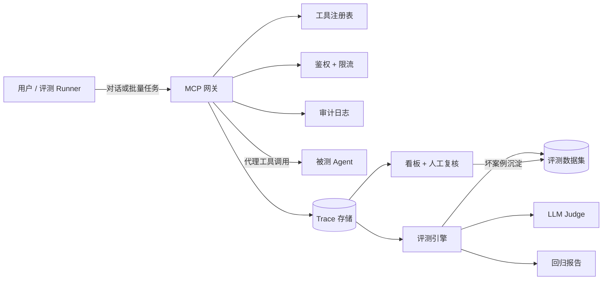

# Agent 接入与质控平台（Agent Connect & QC Platform）设计文档

> 状态：已确认 · 日期：2026-08-15 · 作者：本人（简历项目）

## 1. 背景与动机

2026 年企业级 AI Agent 已从 Demo 阶段进入生产落地阶段，但规模化过程中存在三大痛点：**评估与观测缺失**（如何证明 Agent 靠谱）、**系统打通困难**（MCP 集成与治理）、**人机协同不足**（人在哪里审批与兜底）。其中"Agent 评测与观测"是商业付费最集中的方向之一，MCP 则已成为事实上的 Agent 工具接入标准（公共 MCP Server 已超过 1 万个）。

本人已完成第一个项目：**智能数据分析 Agent 团队**（LangGraph 多 Agent 编排 + RAG 知识库 + MCP Server 暴露 + FastAPI/React 全栈，131+ 测试）。该项目证明"会造 Agent"，但缺少"如何证明 Agent 可靠"的能力。

本项目定位为第一个项目的自然延伸：**一个基于 MCP 接入标准、面向 Agent 的质控平台**，把"接入 → 观测 → 评测 → 治理"做成闭环，并以数据分析 Agent 作为首个接入对象完成真实演示。

## 2. 产品定位与目标

**一句话定位**：任何 Agent 通过 MCP 接入平台，平台统一完成观测、评测与治理。

**核心目标**：
1. MCP 网关提供扎实的接入能力：工具注册、鉴权、限流、审计、调用转发。
2. Trace 观测记录每次工具调用的全量事实（结果、延迟、成本、状态）。
3. 评测引擎提供可量化、可回归的质量评估：确定性校验 + LLM-as-Judge 双轨。
4. 看板与治理模块提供质量趋势、成本指标与人工复核闭环，坏案例可沉淀为回归用例。

**非目标（MVP 明确不做）**：多租户、告警通知、实时流式 UI、CI 回归 webhook、Postgres 实际迁移（仅保留可替换接口）、MCP 发现中心。

## 3. 成功标准

- 完整闭环可演示：注册接入数据分析 Agent → 对话产生 trace → 批量评测出分 → 看板呈现趋势 → 人工标记坏案例 → 沉淀为用例 → 回归对比通过率变化。
- 回归演示：同一数据集对 Agent 两个版本各跑一轮，输出逐用例对比（通过/失败/分数变化）。
- 后端 pytest 100+ 通过。
- Docker Compose 一键启动前后端。
- README、架构图、API 文档齐全。

## 4. 名词定义

| 名词 | 定义 |
| --- | --- |
| 被测 Agent（SUT） | 接入平台接受评测的 Agent，首个为数据分析 Agent 团队 |
| MCP 网关 | 平台接入层，代理 SUT 的工具调用并做注册/鉴权/限流/审计 |
| Trace | 一次工具调用的完整记录（参数脱敏、结果摘要、延迟、成本、状态） |
| 评测用例（Eval Case） | 一个输入 + 期望行为描述 + 检查项集合 |
| 评测数据集（Dataset） | 一组评测用例的集合 |
| 检查（Check） | 对一次回答/行为的判定规则：确定性检查或 LLM 评分检查 |
| 评测运行（Run） | 数据集在某个 Agent 版本上完整执行一轮的结果 |
| 回归（Regression） | 两个版本（基线 vs 新版本）对同一数据集的逐用例对比 |

## 5. 架构总览



四个模块职责边界：

1. **MCP 网关**：只做五件事——工具注册、API Key 鉴权、限流、审计日志、调用转发。不做发现中心、不做多租户。
2. **Trace 观测**：网关每次代理调用落一条 trace；按会话聚合；参数入库前脱敏。
3. **评测引擎**：数据集管理、检查执行（确定性 + LLM Judge）、运行编排、回归对比、坏案例沉淀。
4. **看板与治理**：质量趋势、成本/延迟/成功率指标、trace 浏览、人工复核队列。

## 6. 模块设计

### 6.1 MCP 网关

- **工具注册表**：Agent 注册后，平台通过 MCP 协议拉取工具列表（name、description、schema），存库并在状态变化时同步。
- **鉴权**：每 Agent 一个 API Key，服务端只存 pbkdf2 哈希；调用方请求头携带 Key，网关校验后放行。
- **限流**：按 Agent 配置 QPS/日配额；超限返回 429 + Retry-After。
- **审计日志**：每次代理调用记录请求 ID、Agent、动作、来源、结果状态；审计日志只追加不修改。
- **调用转发**：内部使用 MCP SDK 客户端连接 SUT 的 MCP Server（HTTP）；SUT 不可用返回 504 并落 failed trace。保留 HTTP 直连 fallback，降低对 SDK 版本的耦合。

### 6.2 Trace 观测

- 每次代理调用生成一条 trace：trace_id、会话 ID、Agent ID、工具名、脱敏参数、结果摘要、状态（success/failed/timeout/ratelimited）、延迟 ms、token 用量、估算成本、错误码与错误信息。
- 结果摘要截断存储（默认 2000 字符），避免大结果撑爆存储。
- 提供按 Agent / 会话 / 状态 / 时间范围查询接口。

### 6.3 评测引擎

- **数据集**：名称 + 描述 + 用例列表。用例字段：输入 prompt、期望行为描述（human-readable）、检查项 JSON、可选来源 trace_id（坏案例沉淀时填充）。
- **检查项（Check）**：
  - 确定性检查：`exact`（精确匹配）、`contains`（包含）、`regex`（正则）、`numeric_range`（数值区间）、`tool_called`（必须调用某工具）、`not_tool_called`（禁止调用某工具）、`json_path`（JSON 路径取值断言）。
  - LLM 评分检查（Judge）：针对自由文本回答，按 rubrik 打 1–5 分并输出理由。
- **运行编排**：Runner 逐用例执行：发送输入 → 走网关产生 trace → 收集回答与 trace → 跑确定性检查 → 需要时跑 Judge → 写结果。中途失败支持断点续跑（按 run_id 跳过已完成用例）。
- **回归对比**：同一数据集、两个 agent_version 各一次运行，生成逐用例对比表 + 汇总（通过率、平均分、分数变化、失败用例清单）。
- **坏案例沉淀**：人工在复核队列标记"坏"的 trace，一键转成新用例（自动填充输入与来源 trace_id），纳入指定数据集。

### 6.4 看板与治理

- 总览：trace 总量、成功率、平均延迟、累计成本、最近一次评测通过率。
- 质量趋势：按天/按运行展示通过率与平均分折线。
- Trace 浏览：列表 + 详情（工具调用链、参数、结果、耗时、成本）。
- 复核队列：pending 状态 trace 列表，支持 approve / reject + 备注；reject 可沉淀为用例。

## 7. 数据模型

```text
agents(id, name, mcp_url, api_key_hash, rate_limit_qps, status, created_at)
tools(id, agent_id, name, description, input_schema_json, status, synced_at)
api_keys(id, agent_id, key_hash, scopes, created_at, revoked_at)
traces(id, trace_id, session_id, agent_id, tool_name, params_masked_json,
       result_summary, status, latency_ms, token_usage, cost, error_code, error_message, created_at)
sessions(id, external_session_id, agent_id, user_ref, started_at)
eval_datasets(id, name, description, created_at)
eval_cases(id, dataset_id, input_prompt, expected_behavior, checks_json, source_trace_id, created_at)
eval_runs(id, dataset_id, agent_version, status, started_at, finished_at, summary_json)
eval_results(id, run_id, case_id, trace_id, deterministic_pass, judge_score,
             judge_reason, judge_degraded, overall_pass, created_at)
audit_logs(id, agent_id, action, request_id, source, result, created_at)
review_queue(id, trace_id, status, reviewer_note, created_at, decided_at)
```

存储先用 SQLite；DAO 层按 Postgres 兼容设计（URL 可切换），迁移留作后续。

## 8. API 设计

| 方法 | 路径 | 说明 |
| --- | --- | --- |
| POST | /api/v1/agents/register | 注册 Agent，返回 API Key |
| GET | /api/v1/agents | Agent 列表 |
| POST | /api/v1/agents/{id}/tools/sync | 从 MCP 拉取工具列表 |
| POST | /api/v1/proxy/call | 网关代理调用（核心转发入口） |
| GET | /api/v1/traces | trace 查询（分页/过滤） |
| GET | /api/v1/traces/{id} | trace 详情 |
| POST | /api/v1/datasets | 创建数据集 |
| POST | /api/v1/datasets/{id}/cases | 添加用例 |
| POST | /api/v1/runs | 启动评测运行 |
| GET | /api/v1/runs/{id} | 运行详情与结果 |
| GET | /api/v1/runs/{id}/regression?baseline= | 回归对比 |
| GET | /api/v1/metrics/overview | 看板总览指标 |
| GET | /api/v1/review-queue | 复核队列 |
| POST | /api/v1/review-queue/{id}/decide | 审批/驳回，驳回可沉淀用例 |

## 9. 评测方法论细节

### 9.1 LLM-as-Judge 设计

- 模型：DeepSeek，temperature 0，结构化 JSON 输出 `{score, reason, issues[]}`。
- Rubrik（1–5 分）：正确性（事实与工具结果一致）、工具使用恰当性（该调工具时调用、不滥用）、无幻觉（数字必须有工具出处）、完整性（问题要点是否覆盖）。
- 防抖：temperature 0 + 同一用例失败时最多重试 2 次（指数退避）。
- 降级：Judge 连续失败则本次仅以确定性检查为准，并在结果中标记 `judge_degraded=true`。
- 成本控制：Judge 只对自由文本型用例执行；数据集规模控制在 30–50 用例。

### 9.2 回归判定规则

- 用例通过 = 确定性检查全部通过 且（无 Judge 检查 或 Judge 分数 ≥ 4）。
- 回归对比输出：每用例通过/失败/分数变化；汇总通过率差值、平均分差值；列出"新版本引入的失败用例"作为重点排查清单。

## 10. 关键流程

1. **观测闭环**：用户提问 → 网关鉴权转发 → SUT 调工具 → 网关落 trace → 看板可见。
2. **评测闭环**：Runner 批量执行用例 → 产生 trace → 确定性检查 + Judge → 结果入库 → 汇总。
3. **沉淀闭环**：人工发现坏案例 → 标记 reject → 转成用例 → 后续回归自动覆盖。

## 11. 错误处理与鲁棒性

- Agent 未注册 / Key 无效：401 / 404，明确错误码，不静默。
- SUT 超时（默认 30s）：504，落 failed trace。
- 限流超限：429 + Retry-After。
- Judge 超时：指数退避重试 2 次，仍失败则降级并标记。
- 评测中途失败：按 run 断点续跑，已完成用例不重复执行。
- 外部依赖缺失（LLM Key、SUT 服务）：平台自身功能（注册、查询、看板）保持可用。
- 参数脱敏：入库前对手机号、身份证、金额类字段按正则掩码（如 `138****1234`、`****`）。

## 12. 安全与隐私

- API Key 仅存 pbkdf2 哈希，不存明文；支持吊销。
- trace 默认不存对话原文，只存工具参数（脱敏）与结果摘要。
- 审计日志只追加，提供查询接口。
- 前端仅展示脱敏后数据。

## 13. 测试策略

- **单元测试**：注册表、鉴权、限流、审计、代理转发（mock MCP）、每种确定性检查、Judge 输出解析、数据集 CRUD、脱敏规则。
- **集成测试**：mock SUT 走完整闭环——注册 → sync 工具 → 代理调用 → trace 落库 → 评测运行 → 回归对比。
- **端到端演示**：真实数据分析 Agent 跑 3 个代表性场景（见 §15）。
- 目标 100+ pytest；前端做基础组件冒烟。

## 14. 技术栈与目录结构

**技术栈**：Python FastAPI + SQLAlchemy + Pydantic；React + TypeScript + Vite + ECharts；pytest；Docker Compose；LLM 用 DeepSeek；MCP 用官方 Python SDK（客户端）。

```text
agent-qc-platform/
├── backend/
│   ├── app/
│   │   ├── api/        # agents / traces / datasets / runs / metrics / review
│   │   ├── gateway/    # registry / auth / ratelimit / audit / proxy
│   │   ├── trace/      # capture / store / query / masking
│   │   ├── eval/       # datasets / checks / judge / regression / runner
│   │   ├── schemas/
│   │   └── core/       # config / db
│   ├── tests/
│   └── pyproject.toml
├── frontend/           # React + Vite + ECharts
├── docs/
│   └── superpowers/specs/
├── docker-compose.yml
└── README.md
```

## 15. 演示场景（首个接入对象：数据分析 Agent 团队）

1. **归因分析**："上传销售数据，本月销售额下降的原因是什么？" → 期望：调用数据加载/归因工具，结论数字与工具结果一致。
2. **图表生成**："按品类画柱状图" → 期望：必须调用 chart 工具且返回图表描述；Judge 检查输出可读性。
3. **口径问答**："退款率怎么算？" → 期望：命中 RAG 口径知识，回答与知识库一致（`contains` 检查关键口径词）。

## 16. 风险与应对

| 风险 | 应对 |
| --- | --- |
| Judge 不稳定 | 低温 + 结构化输出 + 重试 + 降级（§9.1） |
| MCP 对接复杂度 | 网关内用 SDK 封装 + HTTP fallback；先 mock SUT 打通再接入真实 Agent |
| 一个月超支 | MVP 裁剪清单明确（§2 非目标）；超时优先砍看板细节，不砍评测闭环 |
| 评测成本 | 数据集 30–50 用例、Judge 只跑自由文本用例、DeepSeek 低价模型 |

## 17. 里程碑（四周）

- **W1**：项目骨架 + MCP 网关（注册/鉴权/限流/审计/转发）+ trace 采集存储 + 基础 API + 单元测试。
- **W2**：评测引擎（数据集/确定性检查/Judge/运行编排）+ 测试。
- **W3**：回归对比 + 看板（趋势/成本/复核队列）+ 坏案例沉淀。
- **W4**：接入真实数据分析 Agent、演示闭环打磨、Docker 部署、README/API 文档、全量测试收尾。

## 18. 简历定位（草案）

**项目**：Agent 接入与质控平台（Agent Connect & QC Platform）
**技术**：FastAPI · React · MCP · LangGraph · DeepSeek · Docker
**要点**：
- 基于 MCP 标准的 Agent 质量管控平台，实现接入、观测、评测、治理闭环；以自研多 Agent 数据分析系统为首个接入对象。
- 自研评测引擎：确定性校验 + LLM-as-Judge 双轨，支持数据集、回归对比与坏案例沉淀，通过率/成本/延迟可量化。
- MCP 网关实现工具注册、API Key 鉴权、限流与审计，体现生产级接入治理能力。
- 100+ 自动化测试，Docker 一键部署。
